# 课程前的话

## 课程目标
1. **掌握操作系统设计实现原理**（特别是常见的操作系统习题、试题的理解和解答方法）；
2. **了解高级系统相关内容**（主要包括网络OS与分布式系统的概念、特点、应用和体系结构与软硬件组成等）。


## 课程内容与教材：
1. 网络与分布式操作系统概述
2. 操作系统原理要点梳理
3. 操作系统习题和试题举例与解答

参考书：
1. 操作系统教程（第6版），骆斌 葛季栋 费翔林 编著，高等教育出版社，2020-12；
2. Operating System——Internals and Design Principles, William Stallings, Prentice Hall/清华大学出版社


## 本课程考试：
1. 平时成绩50%（5次测试，每次10%）
2. 期末考试50%（闭卷）


# 分布式系统——概述

## 1、分布式系统的定义
**分布式系统**是：一个独立的计算机的集合，在它的用户看来是一个**单一的连贯的系统**。

**什么是分布式系统？**
分布式系统的定义，尚不存在一致性的，普遍接受的定义，我们定义：
分布式系统是若干台独立计算机的一种联合体，对用户而言，这个联合体就是一台单独的计算机。
在这个定义中，前半句说明是对计算机硬件的要求，后半句是对计算机软件的要求，这两项都是对分布式系统基本的要求。

另一个角度：分布式系统是这样的一个系统，它运行在不具有共享内存的多台计算机上，但在用户眼里它却像是一台计算机。

实质思想：用户不必去关心系统中的多台计算机的存在。
尽管目前不存在完全满足条件的系统，但已经有一些原型出现。


中间件组织起来的分布式系统。请注意，中间件层扩展到多台机器上。


## 2、分布式系统的特点

### （1）资源共享（Resource Sharing）
- 硬件资源共享：专用设备共享 => 处理资源共享 => 负载共享与负载均衡
- 信息资源共享：例如，电子商务应用共享同一数据对象，协同工作组共享同一数据空间
- 软件资源共享：软件开发组共享同一开发工具，同一类应用任务调用同一处理软件
- 资源异构、分布 => 资源**命名**方案、分布资源**管理**模型、策略与机制是要解决的重点
- 互联网络环境 => 计算资源共享和多媒体信息资源共享成为研究和开发的热点

### （2）透明性（Transparency）
- 透明性的基本概念和内容
  - 机器边界、网络细节和系统状态对用户和应用程序员不可见性。多计算机环境 -> 单机环境。例如，用户不必知道数据存在何处，进程在何处运行。
- 所具有的优点
  - 软件易于研制；资源变动，软件影响小；
  - 易于实现资源冗余；有利资源操作移动
- 实现难点
  - 大多数分布计算系统固有的异构型增加了透明性实现的难度。
  - 硬件异构型：指令系统不同、数据表示不同、系统配置不同
  - 软件异构型：操作系统不同、网络协议不同
  - 局部自洽性限制全局透明性

分布式系统中不同形式的透明性。
| Transparency 透明度 | Description 描述                       |
| ------------------- | -------------------------------------- |
| Access 访问         | 隐藏数据表示和访问资源的方式之间的差异 |
| Location 位置       | 隐藏资源的位置                         |
| Migration 迁移      | 隐藏资源可能移动到另一个位置           |
| Relocation 重定位   | 隐藏资源在使用时可能被移动到另一个位置 |
| Replication 复制    | 隐藏资源可能被部署并复制多个副本       |
| Concurrency 并发性  | 隐藏资源可能被多个竞争用户共享         |
| Failure 故障        | 隐藏资源的故障和恢复                   |
| Persistence 持久性  | 隐藏（软件）资源是在内存中还是在磁盘上 |

### （3）开放性（Openness）
- 是指系统以各种方式进行**扩展的能力**。核心是要求不同厂家的系统（软硬件）具有**互操作性**（Interoperability）和**可移植性**（Portability）。
  - **互操作性**：不同厂家的系统可有效地相互交换信息
  - **可移植性**：在较大范围的平台上运行同一软件的能力
  - **UNIX**是一个优秀的开放式软件系统：开放式结构、源代码可用、硬件无关性；**TCP/IP**协议是另一个开放式系统的例子。
- **标准化**是实现开放性的基本保证
  - **标准**是已经被广泛接受的一种特定实现方法或功能集（接口）。
  - **开放**概念是一种思想、设计观点、系统特征。因此，标准并不意味是最好的、并不总是绝对需要的（尤其是在早期）、不是一成不变的。
  - 网络标准化组织**ISO**。

### （4）延展性（Scalability）
延展性的制约：
可扩展性限制的示例。
| 概念       | 示例                       |
| ---------- | -------------------------- |
| 集中式服务 | 为所有用户提供单一的服务器 |
| 集中式数据 | 单一在线电话簿             |
| 集中式算法 | 基于完整信息进行路由处理   |


之间的区别：一个服务器或客户端检查表单，因为他们正在填写


将DNS名称空间划分为区域的示例。

### （5）容错性（Fault Tolerance）
- **基本概念**：系统部分失效时能继续发挥作用的能力，如某个网络节点故障而不影响网络系统正常行为
- 分布计算系统的**资源多重性**为实现容错创造条件：硬件资源冗余、数据多副本、动态切换。
- 系统容错是提高系统**可靠性**的重要途径。可靠性描述了系统成功运行的寿命特征。
- 容错性是分布计算应用的强烈需求：国防应用系统，电子商务应用的电子支付系统。

> 有学者认为，只有同时具备共享、开放、透明、可延展和容错性的计算机系统，才能被称为分布式系统。  
> 但遗憾的是，完全具备5大特征的分布式系统目前还不存在。但是，越来越多的系统部分具备了分布式系统的某些特征——这是现实的系统演进之路。  


## 3、硬件概念

分布式计算机系统中不同的基本组织和存储器。

总线的多处理器。


一个交叉开关。


Omega交换网络。


网格。


超立方体。


## 4、软件概念
| 系统               | 描述                                                   | 主要目标                 |
| ------------------ | ------------------------------------------------------ | ------------------------ |
| DOS 分布式操作系统 | 为多处理器和同构多计算机设计的紧密耦合操作系统         | 隐藏和管理硬件资源       |
| NOS 网络操作系统   | 为异构多计算机（局域网和广域网）设计的松散耦合操作系统 | 为远程客户端提供本地服务 |
| Middleware 中间件  | 在NOS之上实现通用服务的附加层                          | 提供分布式透明性         |

### 单处理器操作系统
通过微内核将应用程序与操作系统代码分离。


用于保护整数不受并发访问影响的监视器。
```cpp
monitor Counter {
    private:
        int count = 0;
    public:
        int value() { return count; }
        void incr() { count++; }
        void decr() { count--; }
}
```
```cpp
monitor Counter {
    private:
        int count = 0;
        int blocked_procs = 0;
        condition unblocked;
    public:
       int value() { return count; }
       void incr() {
           if (blocked_procs == 0) {
               // 无冲突（没有其他进程使用）时，增值；
               count++;
           } else {
               // 否则，唤醒阻塞进程。
               signal(unblocked);
           }
       }
        void decr() {
            if (count == 0) {
                // 否则，唤醒“减者”直到被“增者”唤醒。
                blocked_procs++;
                wait(unblocked);
                blocked_procs--;
            } else {
                // 计数器大于零时，直接减值；
                count--;
            }
        }
}
```

### 多计算机操作系统
多计算机操作系统的一般结构。


消息传递中阻塞和缓冲的替代方案。


**阻塞**、**缓冲**和**可靠通信**之间的关系。
| 同步点                     | 发送缓冲区 | 可靠通信是否得到保证？ |
| -------------------------- | ---------- | ---------------------- |
| 阻塞发送方，直到缓冲区不满 | 是         | 不必要                 |
| 阻塞发送方，直到消息发送   | 否         | 不必要                 |
| 阻塞发送方，直到消息接收   | 否         | 必要的                 |
| 阻塞发送方，直到消息已传递 | 否         | 必要的                 |

### 分布式共享内存系统
地址空间的页面分布在四台机器上。


当CPU 1引用第10页时的情况。


如果第10页是只读的，并且使用了复制，则情况如何。


两个独立进程之间对页面的错误共享。


### 网络操作系统
网络操作系统的一般结构。


不同的客户端可能会将服务器挂载在不同的位置。


### 定位中间件
分布式系统的一般结构作为：


### 中间件与开放性
在一个开放的基于中间件的分布式系统中，每个中间件层使用的协议应该是相同的，它们提供给应用程序的接口也应该是相同的。


### 系统之间的比较
多处理器操作系统、多计算机操作系统、网络操作系统和基于中间件的分布式系统之间的比较。

| 项目                       | 多处理器操作系统 | 多计算机操作系统 | 网络操作系统 | 基于中间件的分布式系统 |
| -------------------------- | ---------------- | ---------------- | ------------ | ---------------------- |
| 透明度程度                 | 非常高           | 高               | 低           | 高                     |
| 所有节点上都相同的操作系统 | 是               | 是               | 否           | 否                     |
| 操作系统的副本数           | 1                | N                | N            | N                      |
| 通信基础                   | 共享内存         | 消息             | 文件         | 特定于模型             |
| 资源管理                   | 全局集中式       | 全局分布式       | 每个节点     | 每个节点               |
| 可扩展性                   | 否               | 适度             | 是           | 不同                   |
| 开放性                     | 封闭             | 封闭             | 开放         | 开放                   |


## 5、分布式系统的类型

### （1）Distributed Computing System（DCS）分布式计算系统
网络的迅猛发展


网络发展的必然结果


#### 集群系统
用高速网络互联多台主机，通过管理节点为用户提供“单一系统”的并行计算服务。


#### 网格计算系统
由多台主机、多个集群构成，在动态变化、多个机构组成的虚拟组织中协调资源共享和求解问题的计算系统。


#### 云计算系统
**云计算的定义**
云计算是一种商业计算模型，它将计算任务分布在由大量计算机构成的资源池上，使各种应用系统能够根据需要获取计算力、存储空间和各种软件服务。

**云计算的技术背景**
云计算是并行计算（Parallel Computing）、分布式计算（Distributed Computing）和网格计算（Grid Computing）的发展，或者说是这些概念的商业实现。
云计算是虚拟化（Virtualization）、效用计算（Utility Computing）、laaS（基础设施即服务，Infrastructure as a Service）、PaaS（平台即服务，Platform as a Service）和SaaS（软件即服务，Software as a Service）等概念演进并跃升的结果。

**云计算的概念模型**


**云计算的服务模型**


**云计算技术体系结构**


**云计算简化实现机制**


**云计算的特点**
虚拟化、高可靠性、按需服务、通用性、超大规模、高可扩展性、极其廉价

**网格计算与云计算的比较**
| 网格计算     | 云计算       |
| ------------ | ------------ |
| 异构资源     | 同构资源     |
| 不同机构     | 单一机构     |
| 虚拟组织     | 虚拟机       |
| 科学计算为主 | 数据处理为主 |
| 高性能计算机 | 服务器/PC    |
| 紧耦合问题   | 松耦合问题   |
| 免费         | 按量计费     |
| 标准化       | 尚无标准     |
| 科学界       | 商业社会     |

### （2）Distributed Information System（DIS）分布式信息系统

#### 事务处理系统
- 事务与事务处理
- 分布式事务处理系统

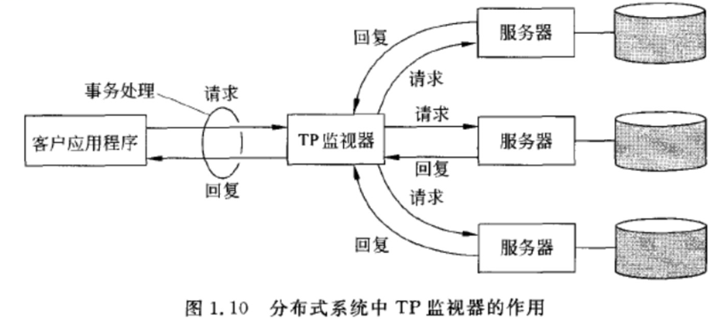

#### 企业应用集成系统
- 消息中间件
- WEB服务总线

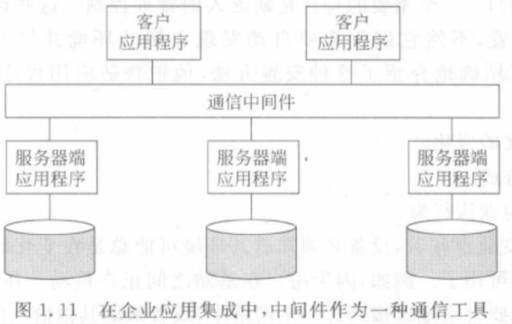

### （3）Distributed Pervasive System（DPS）分布式普适系统
- 智能家居系统
- 智慧医疗系统
- 传感网、物联网系统

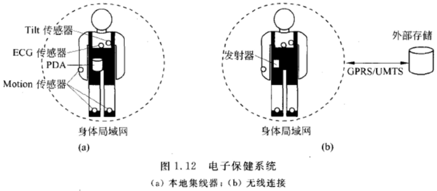


# 分布式系统——体系结构

## 1、架构风格
- Layered Architecture（分层架构）
- Object-based Architecture（面向对象架构）
- Data-centered Architecture（数据中心架构）
- Event-based Architecture（事件驱动架构）

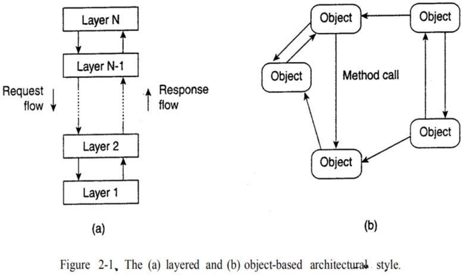
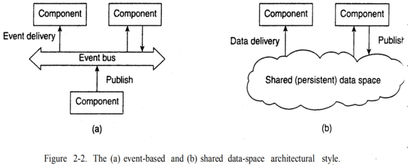


## 2、系统架构

### （1）Centralized Architecture（集中式架构）
集中式的体系结构是C/S。
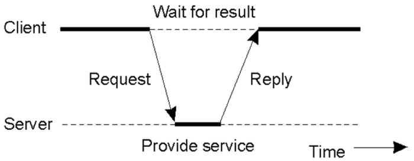
客户端和服务器之间的一般交互。

#### 应用程序级别
Internet搜索引擎的一般结构分为三个不同的层
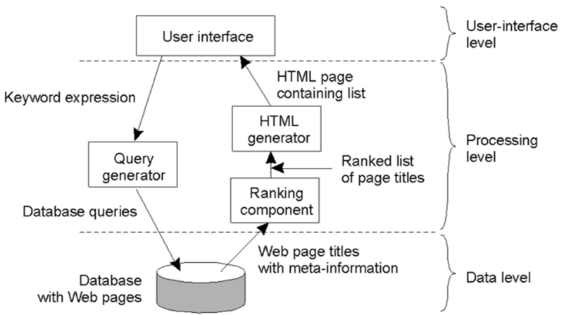

#### 多层体系结构
替代的客户机-服务器组织
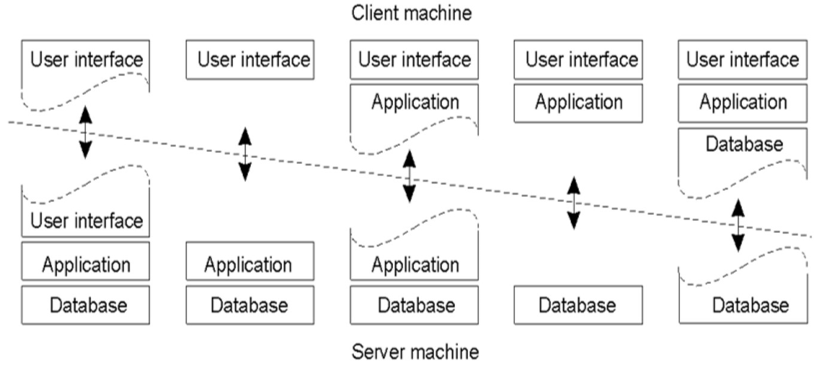

服务器作为客户端的例子。
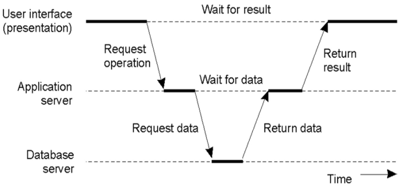

#### 现代架构
Web服务水平分布的一个示例。
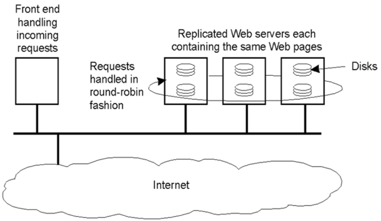

### （2）Decentralized Architecture（分散式架构）

#### Strucutred P2P Architectures（结构化P2P架构）

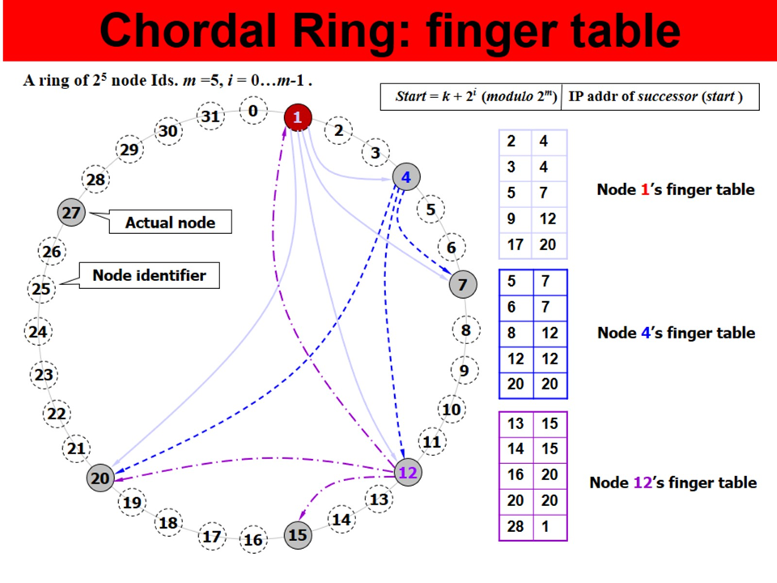

CAN示例：二维空间
- 每个项都由在空间中拥有其映射的节点存储
  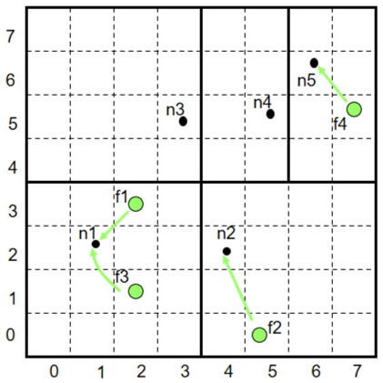

CAN：查询示例
- 每个节点都知道它在d空间中的邻居
- 将查询转发到最接近查询的邻居id
- 示例：假设n1查询f4
  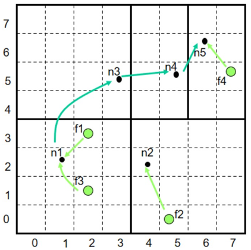

#### Unstructured P2P Architectures（非结构化P2P架构）
Gnutella
- 分发文件位置和去中心化查找
- 想法：组播请求
- 如何找到文件：
  - 将请求发送给所有邻居节点
  - 邻居节点递归地组播请求
  - 最终拥有该文件的节点接收到请求，并发送回答案
- 优点：完全去中心化，高度鲁棒
- 缺点：不可扩展；整个网络可能被请求淹没（为了缓解这个问题，每个请求都有一个TTL）

Gnutella：示例
- 假设：m1的邻居是m2和m3；m3的邻居是m4和m5；...
  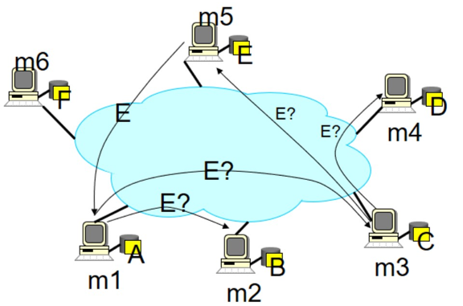

#### Topology Management of Overlay Networks（覆盖网络的拓扑管理）
覆盖网络：一个通用模型
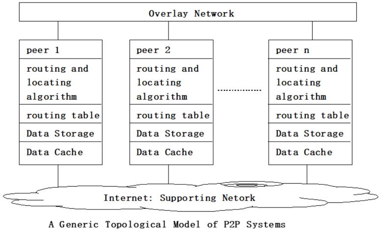

覆盖网络：映射到IP网络
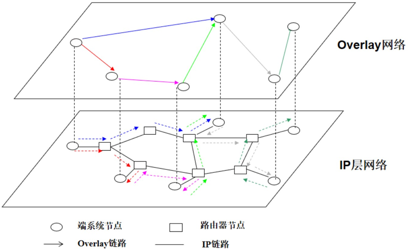

### （3）Hybrid Architecture（混合式架构）

#### Superpeers
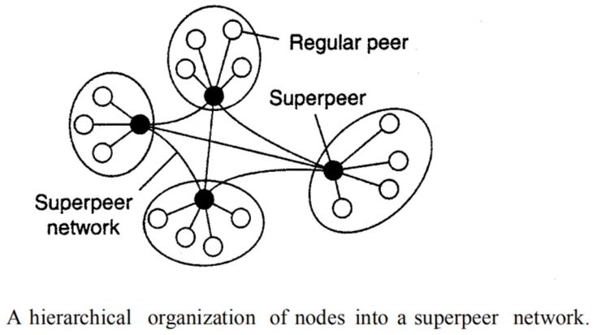

#### Edge-Server Systems
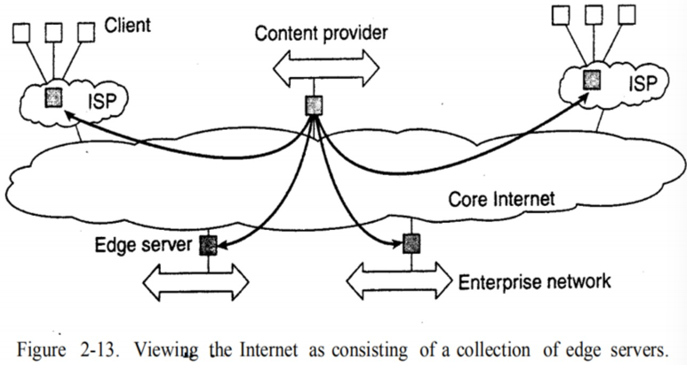

#### Collaborative Distributed Systems
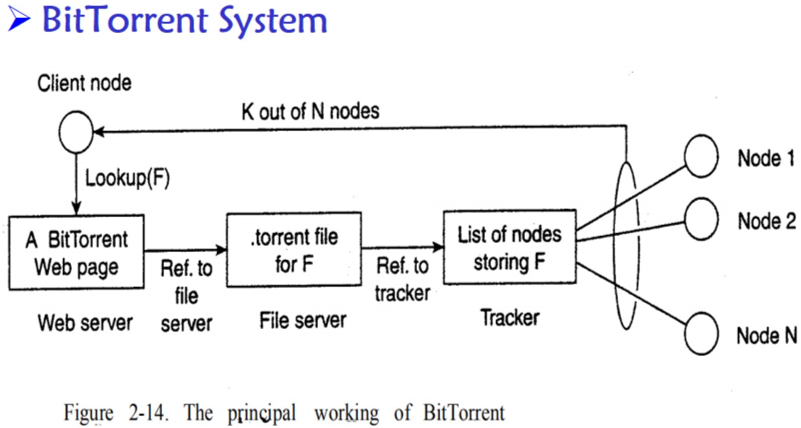


## 3、架构 vs 中间件
Interceptors（拦截器）
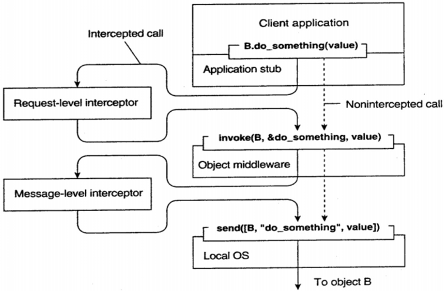

### Distributed Object（分布式对象）
适应性软件的一般方法
- 远程对象与客户端共同组织
  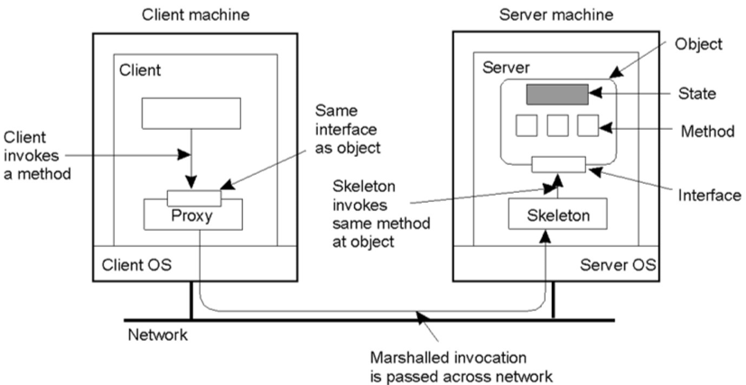

### Parameter Passing（参数传递）
通过引用或值传递对象时的情况
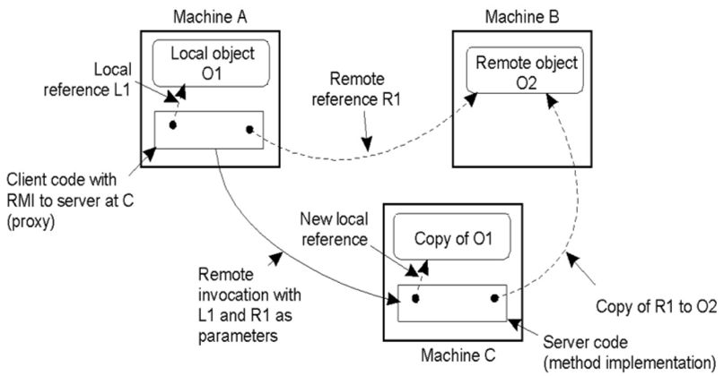

### The DCE Distributed-Object Model（DCE分布式对象模型）
分布式动态对象（左）分布式命名对象（右）
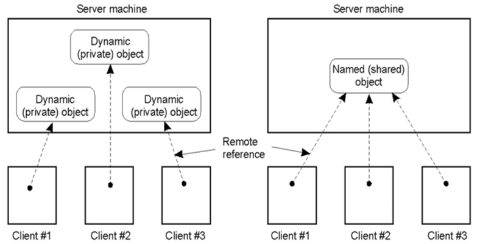
  

## 4、分布式系统中的自我管理
Autonomic Computing（自主计算）
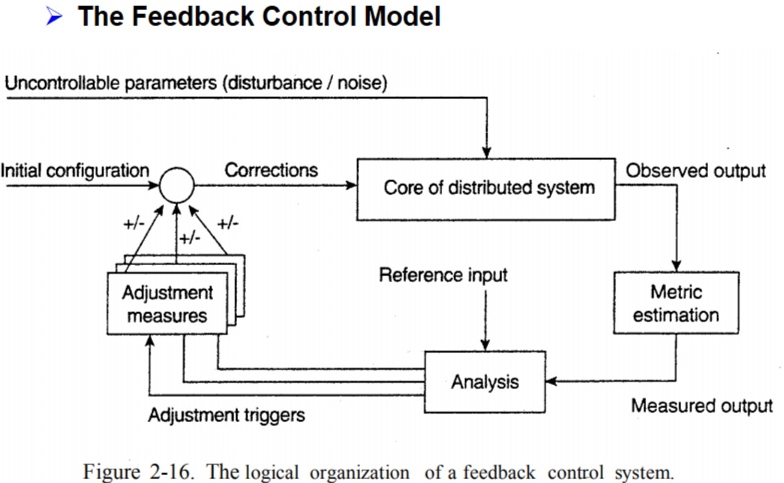

### 一些例子
Astrolabe系统监控
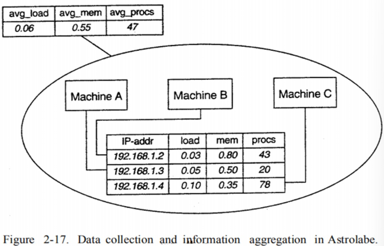

Globule中的差异化复制策略
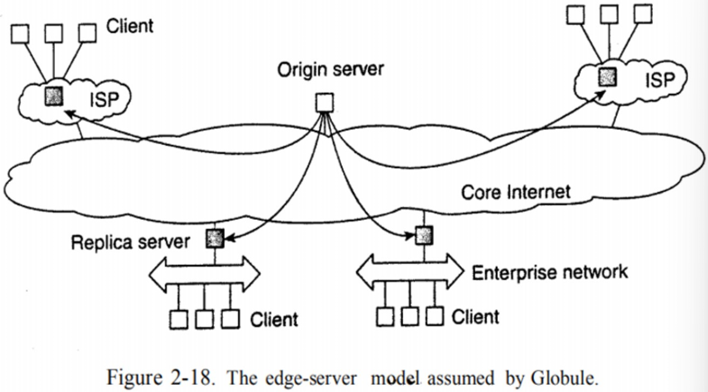

Jade中的自动组件修复管理
- 基于分形组件模型构建
- 维修管理领域
- 独立的节点管理器
- 节点故障检测器
- 维修策略
  - 终止非故障节点上组件与已故障节点上组件之间的所有绑定。
  - 请求节点管理器启动并将新节点添加到域中。
  - 将新节点配置为与崩溃节点上完全相同的组件。
  - 重新建立先前终止的所有绑定。


