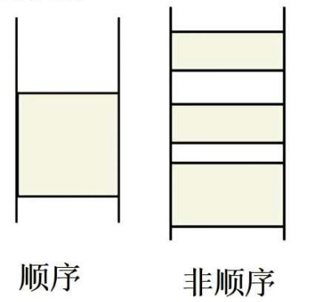
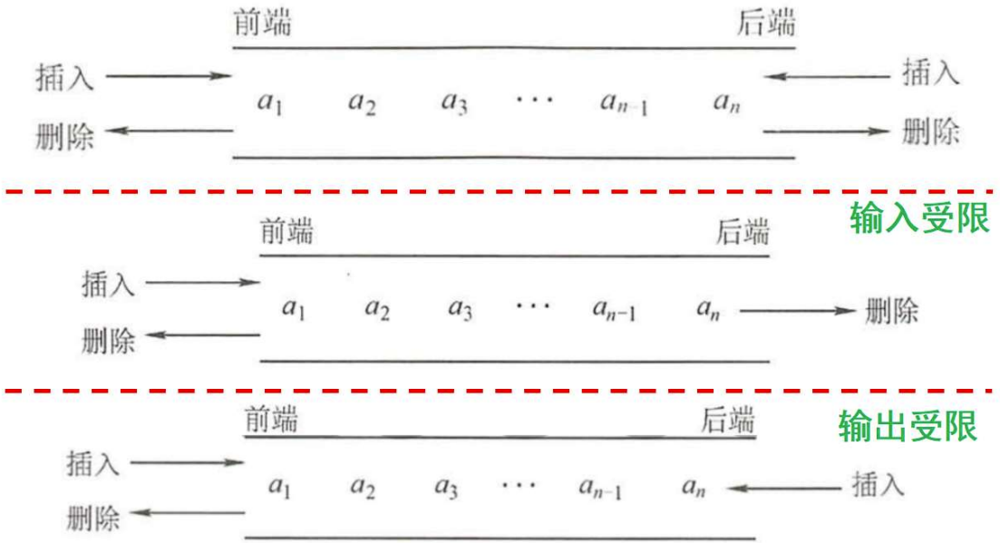
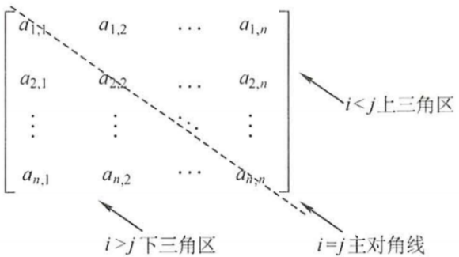
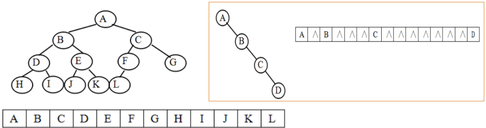
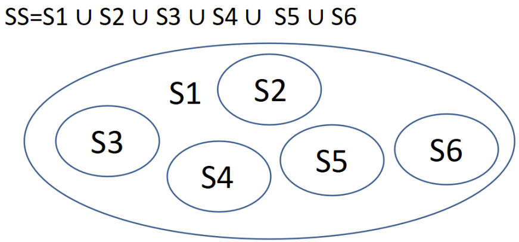
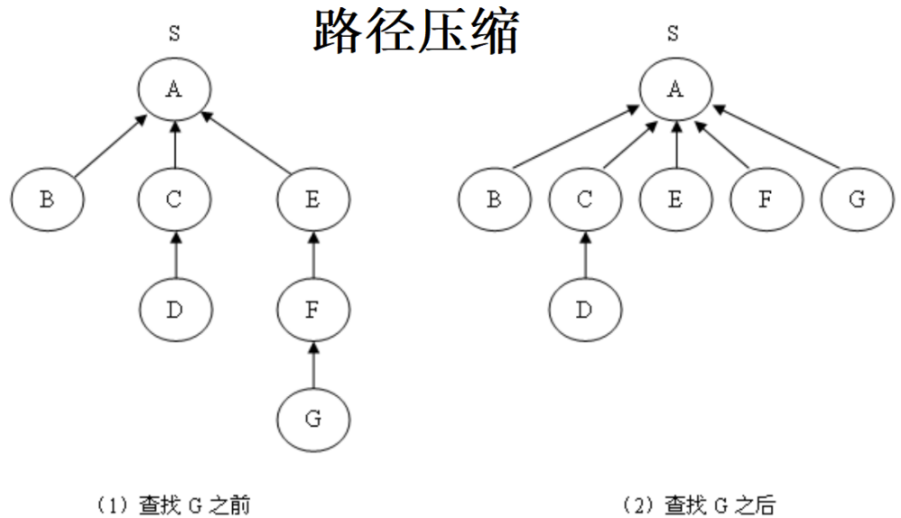

# 第0章 课程安排
总成绩 = 20%平时（考勤+课堂表现） + 20%作业（雨课堂完成每章一个测试卷） + 60%考试（闭卷考试）


# 第1章 绪论

## 本章内容
- 1.1 基本概念
  - 数据，数据对象，数据元素，数据项
  - 数据类型（原子、构造、抽象）
  - 数据结构
- 1.2 数据结构三要素：逻辑结构、物理结构与运算
- 1.3 算法及其评价
  - 算法的定义、特性、设计要求
  - 算法评价：时空复杂度


## 1.1 基本概念
- **数据**：能输入计算机且被处理的各种符号的**集合**。
- **数据元素**：组成数据的基本单位，是数据集合的**个体**。本课程讨论的最小单位。
- **数据对象**：性质相同的数据元素的集合，是数据的一个**子集**。
- **数据结构**：带有某种结构关系的、性质相同的数据元素的集合，包括逻辑关系、物理存储和操作。

数据类型
- **原子类型**：值不可再分的数据类型。如 int,char,double 等。
- **结构类型**：值可以再分解为若干成分的数据类型。如 struct、union 。
- **抽象数据类型ADT**：
  - 数组是什么类型？构造
  - 枚举是什么类型？原子
  - 指针是什么类型？原子

**抽象数据类型**（Abstract Data Type）定了一个数据对象、数据对象中各元素间的结构关系和一组操作。可用一个三元组表示：（数据对象、关系、基本操作）

**抽象是一种思维方式**，抽取问题的本质特征，隐藏了复杂的细节，让使用者**只关注应用**而**不关注实现细节**。

> 哥尼斯堡七桥问题：
> 欧拉回路条件：
> 1. 图形必须是连通的。
> 2. “奇点”个数是0或2。


## 1.2 数据结构三要素
**逻辑结构**：数据元素间的逻辑关系，分为线性结构和非线性结构（集合、树和图结构）。


> 数据元素及其关系的物理存储方式分**顺序存储**和**链式存储**。该说法（ ）。
> - A 正确
> - B 错误

**物理结构**：数据元素及其关系在计算机上的映像。
- 顺序：存储地址连续
- 非顺序：
  - 链式：存储地址不一定连续
  - 索引：需要另外建立索引表上非顺序
  - 散列：哈希存储



**运算（操作）**：施加在数据对象上的一组运算。基于逻辑结构定义，基于存储结构实现。


> 以下属于算法特性的是
> - A 正确性
> - B 可读性
> - C 可行性
> - D 健壮性
> - E 确定性
> - F 有限性


## 1.3 算法特性与性能分析
- **算法定义**：解决特定问题的一系列操作。
  
- **算法特性**：输入（$\ge 0$）、输出（$\ge 1$）、确定性、可行性和有限性。
- **算法设计要求**：正确、可读性、健壮性（鲁棒性）、高效低存储。
- **算法描述**：自然语言、伪代码、流程图、高级语言等。

**评价算法优劣的标准——时空复杂度**

时间复杂度 $T(n) = O(f(n))$ ：算法的时间耗费度量，与输入数据的规模有关。表示当 $n$ 逐渐增大时，算法运行的时间耗费增长率与 $f(n)$ 增长率相同。

时间复杂度分析步骤：
1. 找算法中的基本语句（执行频率最高）
2. 计算其执行次数，整理成问题规模 $n$ 的函数 $f(n)$
3. 保留最高次幂，作为（渐进）时间复杂度

$O(1) \lt O(\log n) \lt O(n) \lt O(n\log n) \lt O(n^2) \lt O(n^3) \lt O(2^n) \lt O(n!) \lt O(n^n)$


- 快速排序算法： $T(n) = O(n\log n)$
- Dijkstra算法： $T(n) = O(n^2)$
- 最大团算法： $T(n) = O(n 2^n)$

> 假设某计算机运行速度为10亿次/秒运算，那么
> - 10万个数据排序： $10^5 \times \log 10^5 \div 10^9 \approx 1.7 \times 10^6 \div 10^9 = 1.7ms$
> - 1万个顶点求单源最短路径： $(10^4)^2 \div 10^9 = 0.1s$
> - 100个J顶点求最大团： $100 \times 2^{100} \div 10^9 \approx 1.8 \times 10^{21}s \approx 5.7 \times 10^{15}年$

```c
int i = 0, sum = 0;
while (sum < n)
{
    i++;
    sum += i;
}
```
时间复杂度：
1. 基本语句：while
2. 执行次数：设while循环语句执行次数为m，i从1开始递增，最后取值为m，则：
   - $sum = 1 + 2 + \ldots + m = m(m+1)/2$ ，即 $m(m+1)/2 \le n$
3. $T(n) = O(\sqrt{n})$

```c
void mergesort(int a[], int i, int j)
{
    int m;
    if (i < j)
    {
        m = (i + j) / 2;
        mergesort(a, i, m);
        mergesort(a, m + 1, j);
        merge(a, i, j, m); // O(n)
    }
}
```
递归方程：
$$
\begin{aligned}
T(n) =& 2 T(n/2) + n \\
=& 2[2T(n/2^2) + n/2] + n \\
=& 2^2 T(n/2^2) + 2n \\
=& 2^3 T(n/2^3) + 3n \\
... \\
=& 2^k T(n/2^k) + kn \\
=& nO(1) + n \log n = n + n \log n \\
=& O(n \log n)
\end{aligned}
$$

递归算法时间复杂度分析：
- **替换法**：迭代替换
- **主方法**：利用主定理。设 $a \ge 1, b \gt 1$ 为常数， $T(n) = aT(n / b) + f(n)$ ， 则 $T(n)$ 计算如下：
  - 如果函数 $n^{log_b a}$ 比函数 $f(n)$ 大，则 $T(n) = O(n^{log_b a})$
  - 如果函数 $n^{log_b a}$ 和函数 $f(n)$ 相同，则 $T(n) = O(n^{log_b a} \log n)$
  - 如果函数 $n^{log_b a}$ 比函数 $f(n)$ 小，则 $T(n) = O(f(n))$

> 

当基本语句执行次数与输入数据的顺序有关时，关注**最坏时间复杂度**。
```c
int Find(int a[], int n, int x)
{
    int i = 0;
    while (i < n) // T(n) = O(n)
    {
        if (a[i] == x)
            break;
        i++;
    }
    return i < n ? i : -1;
}
```

空间复杂度 $S(n) = O(f(n))$ ：算法运行时所占用的存储量，包括形参和临时变量所占空间。在对算法进行存储空间分析时，**只考察临时变量所占空间**。

$S(n)=O(1)$ 的含义：常量空间复杂度，表示算法执行时需要的辅助空间与问题规模无关，也称为算法**原地工作**。
```c
long long Fib(int n)
{
    long long *F = (long long *)malloc(sizeof(long long) * (n + 1)); // S(n)=O(n)
    F[0] = F[1] = 1;
    for (int i = 2; i <= n; i++)
        F[i] = F[i - 1] + F[i - 2];
    return F[n];
}
```

```c
long long Fib(int n)
{
    long x = 1, y = 1, t; // S(n)=O(1)
    for (int i = 2; i <= n; i++)
    {
        t = x;
        x = y;
        y = x + t;
    }
    return y;
}
```

```c
int maxelem(int a[], int i, int j)
{
    int mid = (i + j) / 2, max1, max2; // S(n)=O(n)
    if (i < j)
    {
        max1 = maxelem(a, i, mid);
        max2 = maxelem(a, mid + 1, j);
        return max1 > max2 ? max1 : max2;
    }
    else
    {
        return a[i];
    }
}
```

递归算法空间复杂度 = 每层需要的辅助空间 * 递归深度
```c
typedef int RecordType;
/* r数组中，low到mid单元为一有序序列，mid+1到high为另一有序序列，将二者合并为一个新的有序序列，并放入r数组的low到high单元 */
void Merge(RecordType r[], int low, int mid, int high)
{
    int i, j, k;
    RecordType *A = (RecordType *)malloc(sizeof(RecordType) * (high - low + 1));
    i = low;
    j = mid + 1;
    k = 0;
    while (i <= mid && j <= high)
    {
        if (r[i] <= r[j])
        {
            A[k] = r[i];
            i++;
            k++;
        }
        else
        {
            A[k] = r[j];
            j++;
            k++;
        }
    }
    while (i <= mid)
    {
        A[k] = r[i];
        i++;
        k++;
    }
    while (j <= high)
    {
        A[k] = r[j];
        j++;
        k++;
    }
    for (i = low, k = 0; i <= high; i++, k++)
    {
        r[i] = A[k];
    }
    free(A);
}

void MergeSort(RecordType r[], int low, int high)
{
    int mid;
    if (low < high)
    {
        mid = (low + high) / 2;
        MergeSort(r, low, mid);
        MergeSort(r, mid + 1, high);
        Merge(r, low, mid, high);
    }
}
```
空间复杂度 $S(n)$ ：
- Merge算法中，申请了辅助空间A，该空间的大小为high-low+1。最大时为n，用完即释放。
- 算法递归深度为logn，所以还用了logn的栈空间。
- 因此空间复杂度为 $S(n)=O(n+logn)=O(n)$

> 下面说法：
> - ~~Ⅰ.算法原地工作的含义是指不需要任何额外的辅助空间~~
> - Ⅱ.在相同规模 $n$ 下，复杂度为 $O(n)$ 的算法在时间上总是优于复杂度为 $O(2^n)$ 的算法
> - Ⅲ.所谓时间复杂度，是指最坏情况下估算算法执行时间的一个上界
> - Ⅳ.同一个算法，实现语言的级别越高，执行效率越低

算法时间复杂度估算-非递归算法
```c
// T(n) = O(n^{1/2})
void add(int n)
{
    int i = 0, s = 0;
    while (s < n)
    {
        i++;
        s += i;
    }
}
```

```c
// T(n) = O(n \log n)
i = 1;
while (i < n)
{
    for (j = 1; j <= n; j++)
        x += 1;
    i *= 2;
}
```

```c
// T(n) = O(n \log n)
count = 0;
for (k = 1; k <= n; k *= 2)
    for (j = 1; j <= n; j++)
        count++;
```

```c
// T(n) = O(n^{1/2})
int i = 0, sum = 0;
while (sum < n)
    sum += ++i;
return i;
```

```c
// T(n) = O(n)
i = 1;
j = 0;
while (i + j <= n)
    i > j ? j++ : i++;
```

算法时间复杂度估算-递归算法
```c
// T(n) = O(n^2)
void hanoi(int n, char a, char b, char c)
{
    if (n == 1)
    {
        move(a, 1, c);
    }
    else
    {
        hanoi(n - 1, a, c, b);
        move(a, n, c);
        hanoi(n - 1, b, a, c);
    }
}
```

```c
// T(n) = O(n)
void PreOrder(BinTree T)
{
    if (T)
    {
        visit(T);
        PreOrder(T->Left);
        PreOrder(T->Right);
    }
}
```

```c
// T(n) = O(n)
int sum = 0;
for (int i = 1; i < n; i *= 2)
    for (int j = 0; j < i; j++)
        sum++;
```


```c
// T(n) = O(n^{1/2}) (n>=0)
while (n >= (x + 1) * (x + 1))
    x++;
```


## 缺失的第一个正数
给定一个含 n（`n>=1`）个整数的数组，请设计一个在时间上尽可能高效的算法，找出数组中未出现的最小正整数。例如，数组 `{-5, 3, 2, 3}` 中未出现的最小正整数是 1；数组 `{1, 2, 3}` 中未出现的最小正整数是 4。

要求：
1. 给出算法的基本设计思想。
2. 根据设计思想，采用C或C+语言描述算法，关键之处给出注释。
3. 说明你所设计算法的时间复杂度和空间复杂度。


- [leetcode-41. 缺失的第一个正数](https://leetcode.cn/problems/first-missing-positive/)


# 第2章 线性表
> 线性结构、线性表、顺序表、链表间有什么区别与联系。
> - 线性结构：一种元素间的逻辑关系
> - 线性表：一种抽象数据类型（存储方式分为顺序表/链表），其元素的逻辑结构为线性结构

> 顺序表是有序表。

## 本章内容
- 2.1 线性表的定义
- 2.2 线性表的顺序存储——顺序表及运算实现
- 2.3 线性表的链式存储——链表及运算实现
  - 单链表
  - 双向链表
  - 循环链表
  - 静态链表*
- 2.4 顺序表和链表综合比较

> 重点考察算法思想且对时空复杂度有要求


## 2.1 线性表的定义
线性表为 $n(n>=0)$ 个**相同数据元素**的**有限序列**，其特点为：
存在唯一首元素、尾元素，除首元素和尾元素外，其余每个元素只有一个前驱和后继（线性结构）。


## 2.2 顺序表——线性表的顺序存储
用一段**连续的内存空间**存储线性表中的元素。**逻辑上相邻**的元素，**物理存储**位置**也相邻**。
```c
// 静态分配
#define MAXSIZE 100
typedef struct
{
    ElemType elem[MAXSIZE];
    int last; // 最后元素下标
} SeqList;
```

```c
// 动态分配
typedef struct
{
    Elemtype *pElem;
    int last;
    int maxSize;
} SeqList;
```

顺序表上的基本运算
- 查找： `GetData(L,i); Locate(L,e)`
- 插入：插入位置 $1 \le i \le n+1$ 等概率时，平均移动 $n/2$ 个元素；
- 删除：删除位置 $1 \le i \le n$ 等概率时，平均移动 $(n-1)/2$ 个元素；

顺序表的优缺点：
- 优点：存储密度大（为1）；可随机访问元素。
- 缺点：插入、删除需要移动大量元素；需要连续的内存空间；静态内存分配。

> 存储密度 = 存储元素所占用的总空间 / 存储结构所占用的总空间

> 【例】：线性表采用顺序存储中的动态分配空间。当n个空间已满时，可申请再增加分配m个空间。如果申请失败，说明系统没有（n+m）可分配的连续存储空间。

> 在一个长度为n的顺序表中删除第 $i(1 \le i \le n)$ 个元素时，需向前移动（n-i）个元素。

> 在个元素的线性表的数组表示中，时间复杂度为 $O(1)$ 的操作：
> - Ⅰ.访问第 $i(1 \le i \le n)$ 个结点和求第 $i(2 \le i \le n)$个结，点的直接前驱
> - Ⅱ.在最后一个结，点后插入一个新的结点
> - ~~Ⅲ.删除第1个结点~~
> - ~~Ⅳ.在第 $i(1 \le i \le n)$ 个结点后插入一个结点~~

顺序表中的算法设计，可能会涉及到折半查找、快速排序、归并排序以及《算法设计与分析》课程中的一些经典算法。

【例】：有两个非递减有序顺序表LA和LB，编写算法将二者合并为非递增有序顺序表LC。假设LC足够大。
```c
SeqList *mergeAndReverse(SeqList *LA, SeqList *LB)
{
    if (LA == NULL || LB == NULL)
        return NULL;
    SeqList *LC = (SeqList *)malloc(sizeof(SeqList));
    LC->pElem = (Elemtype *)malloc(sizeof(Elemtype) * (LA->last + LB->last + 2));
    LC->last = -1;
    LC->maxSize = LA->last + LB->last + 2;
    int i = LA->last, j = LB->last;
    while (i >= 0 && j >= 0)
        LC->pElem[++LC->last] = LA->pElem[i] >= LB->pElem[j] ? LA->pElem[i--] : LB->pElem[j--];
    while (i >= 0)
        LC->pElem[++LC->last] = LA->pElem[i--];
    while (j >= 0)
        LC->pElem[++LC->last] = LB->pElem[j--];
    return LC;
}
```

【例】：在长度为n的顺序表L中，删除所有值为e的数据元素。要求时间复杂度为 $O(n)$ 、空间复杂度为 $O(1)$ 。
```c
void DeleteItems(SeqList *L, Elemtype e)
{
    if (L == NULL)
        return;
    int k = 0;
    for (int i = 0; i <= L->last; i++)
        if (L->pElem[i] != e)
            L->pElem[k++] = L->pElem[i];
    L->last = k - 1;
}
```
> 一端工作 类似直接插入排序  
> 算法思想：从空序列开始，依次判断每个元素是否为e：若是e，则继续向后判断，若不是e，则将其插入到前面不含e的列表，继续向后判断。直到结束。  
> 不改变原有元素相对先后顺序  

```c
void DeleteItems(SeqList *L, Elemtype e)
{
    if (L == NULL)
        return;
    int i = 0, j = L->last;
    while (i < j)
    {
        while (i < j && L->pElem[i] != e)
            i++;
        while (i < j && L->pElem[j] == e)
            j--;
        if (i < j)
        {
            Elemtype temp = L->pElem[i];
            L->pElem[i] = L->pElem[j];
            L->pElem[j] = temp;
        }
    }
    L->last = j - 1;
}
```
> 两头夹击 类似一趟快速排序  
> 算法思想：从左边找个是e的元素，从右边找一个不是e的元素，将右边不是e的元素移动到左边元素e的位置。直到左右汇合。  
> 会改变原有元素相对顺序  

【例】已知顺序表L中的数据元素类型为int。设计算法将其调整为左右两部分，左边的元素（即排在前面的）均为奇数，右边所有元素（即排在后面的）均为偶数，并要求算法的时间复杂度为 $O(n)$ ，空间复杂度为 $O(1)$ 。
```c
void AdjustSqlist(SeqList *L)
{
    if (L == NULL)
        return;
    int i = 0, j = L->last;
    while (i < j)
    {
        while (i < j && L->pElem[i] % 2 != 0)
            i++;
        while (i < j && L->pElem[j] % 2 == 0)
            j--;
        if (i < j)
        {
            Elemtype temp = L->pElem[i];
            L->pElem[i] = L->pElem[j];
            L->pElem[j] = temp;
        }
    }
}
```

【例】：在长度为的有序顺序表L中，删除所有值相等的多余元素，要求保持原有元素的相对位置不变，且时间复杂度为 $O(n)$ ，空间复杂度为 $O(1)$ 。
```c
void DeleteRepeatItems(SeqList *L)
{
    if (L == NULL)
        return;
    int i = 0;
    for (int j = 1; j <= L->last; j++)
        if (L->pElem[i] != L->pElem[j])
            L->pElem[++i] = L->pElem[j];
    L->last = i;
}
```
> 算法思想：类似直接插入排序，将第一个元素视为非重复的有序表，然后依次判断后面的元素是否与前面有序表的最后一个元素相同。若相同，则继续向后判断，若不同，则将其插入到前面非重复有序表中。直到结束。

【变形题】：长度为的无序顺序表L存放正整数元素（元素值不大于1000），编写算法，每个元素保留第一次出现的元素，删除重复出现的多余元素，要求时间复杂度为 $O(n)$ 。
```c
void DelrepeatElem(SeqList *L)
{
    if (L == NULL)
        return;
    int *hash = (int *)malloc(sizeof(int) * MAXSIZE);
    memset(hash, 0, sizeof(int) * MAXSIZE);
    int i = 0;
    for (int j = 0; j < L->last; j++)
    {
        if (hash[L->pElem[j]] == 0)
        {
            hash[L->pElem[j]] = 1;
            L->pElem[i++] = L->pElem[j];
        }
    }
    L->last = i - 1;
}
```

【例】顺序表 $L = (a_1, a_2, \ldots, a_n, b_1, b_2, \ldots, b_m)$ ，设计一个算法，将顺序表调整为 $L = (b_1, b_2, \ldots, b_m, a_1, a_2, \ldots, a_n)$ 。
```c
// 反转顺序表[a,b)区间
void Reverse(SeqList *L, int a, int b)
{
    if (L == NULL)
        return;
    for (int i = a; i < (a + b) / 2; i++)
    {
        Elemtype temp = L->pElem[i];
        L->pElem[i] = L->pElem[a + b - 1 - i];
        L->pElem[a + b - 1 - i] = temp;
    }
}

// 转换a1-an ba-bm -> b1-bm a1-an
void ExchangeSqlist(SeqList *L, int n, int m)
{
    if (L == NULL)
        return;
    Reverse(L, 0, n + m); // 反转整个顺序表
    Reverse(L, 0, m); // 反转前m个元素
    Reverse(L, m, n + m); // 反转后n个元素
}
```

【例】求主元素。某顺序表中存放正整数，如果存在一个数，其出现的频率大于50%，则称其为该顺序表的主元素。设计一个算法找出顺序表中的主元素，如果没有则输出-1。要求时间复杂度尽可能低。

算法原理：去掉数组中一个主元素和另一个与主元素不相等的数，剩下的数中，主元素的出现频率仍然大于50%。

算法步骤：
1. 将第一个出现的元素保存到majorNum中，用count记录majorNum出现的次数，初始时令count=1。
2. 如果下一个遇到的元素仍然是majorNum则将count加1，否则将count减1。如果count=0，则将下一个元素保存到majorNum中，并重置count为0。重复该步骤，直至扫描完全部元素。
3. 判断此时的majorNum是否为真正的主元素。统计majorNum出现的次数，并保存到count中，如果count>n/2，则是主元素，否则不是。

代码实现：
```c
int Majority(int A[], int n)
{
    int majorNum = A[0];
    int count = 1;
    for (int i = 1; i < n; i++)
    {
        if (A[i] == majorNum)
            count++;
        else
        {
            if (count > 0)
                count--;
            else
            {
                majorNum = A[i];
                count = 1;
            }
        }
    }
    if (count > 0)
    {
        count = 0;
        for (int i = 0; i < n; i++)
            if (A[i] == majorNum)
                count++;
    }
    return count > n / 2 ? majorNum : -1;
}
```

【例】一个长度为N的整型数组 $A[1..N]$ ，给定正整数X，设计一个尽可能高效的算法，查找这个数组中所有两两之和等于X的整数对。若存在，则输出；否则输出“不存在！”
1. 简述算法思想
2. 用C描述该算法
3. 分析算法的时空复杂度。

> 先用快速排序从小到大排序，再从两端开始枚举。

```c
void pairNum(int a[], int n, int target)
{
    // 快速排序（略）
    int i = 0, j = n - 1, f = 0;
    while (i < j)
    {
        if (a[i] + a[j] == target)
        {
            f = 1;
            printf("%d %d\n", a[i], a[j]);
            i++;
            j--;
            continue;
        }
        a[i] + a[j] < target ? i++ : j--;
    }
    if (!f)
        printf("不存在！\n");
}
```

【例】对于给定的含有n元素的无序序列 $a[1..n]$ ，设计时间复杂度尽可能小的算法，查找这个序列中第k小的元素 $(1 \le k \le n)$ ，并分析你所设计算法的时间复杂度。
- 方法一：对a进行排序，则第k小的元素为 $a[k]$ 。
- 方法二：采用堆排序、冒泡或简单选择排序进行k趟排序。
- 方法三：采用快速排序。

方法三：分治求解——快速排序思想
对于序列 $a[1..n]$ ，在其中查找第k小元素的过程如下：以 $a[q]$ 作为基准元素进行划分，其对应下标为i。三种情况：

- 若 $i=k$ ， $a[i]$ 即为所求，返回 $a[i]$ 。
- 若 $i>k$ ，第 $k$ 小的元素应在 $a[1..i-1]$ 子序列中，递归在该子序列中求解第 $k$ 小元素并返回其结果。
- 若 $i<k$ ，第 $k$ 小的元素应在 $a[i+1..n]$ 子序列中，递归在该子序列中求解第 $k-i$ 小并返回其结果。

【2016-408】已知由 $n(n \ge 2)$ 个正整数构成的集合 $A = \{a_k\} \quad (0 \le k \le n)$ ，将其划分为两个不相交的子集 $A_1$ 和 $A_2$ ，元素个数分别是 $n_1$ 和 $n_2$ ， $A_1$ 和 $A_2$ 中元素之和分别为 $S_1$ 和 $S_2$ 。
设计一个尽可能高效的划分算法，满足 $|n_1 - n_2|$ 最小且 $|S_1 - S_2|$ 最大。要求：
1. 给出算法的基本设计思想。
2. 根据设计思想，采用C、C++描述算法，关键之处给出注释。
3. 说明你所设计算法的时间复杂度和空间复杂度。

算法思路：将A递增排序，前 $\left \lfloor n/2 \right \rfloor$ 个元素放在 $A_1$，中，其他放在 $A_2$ 中。实质为查找第 $n/2$ 小元素。
算法步骤：
- 对序列进行一趟快速排序，划分位置为i
- 若 $i = \left \lfloor n/2 \right \rfloor$ ，则划分结束。
- 若 $i < \left \lfloor n/2 \right \rfloor$ ，则枢轴及之前的所有元素均属于 $A_1$ ，继续对 i 之后的元素进行划分。
- 若 $i > \left \lfloor n/2 \right \rfloor$ ，则枢轴及之后的所有元素均属于 $A_2$ ，继续对 i 之前的元素进行划分。

【2020-408】定义三元组 $(a, b, c)$ （$a, b, c$ 均为正数）的距离 $D = |a-b| + |b-c| + |c-a|$ 。给定3个非空整数集合 $S_1, S_2, S_3$ ，按升序分别存储在3个数组中。请设计一个尽可能高效的算法，计算并输出所有可能的三元组 $(a, b, c)$ （其中 $a \in S_1, b \in S_2, c \in S_3$ ）中的最小距离。例如 $S_1 = \{-1, 0, 9\}, S_2 = \{-25, -10, 10, 11\}, S_3 = \{2, 9, 17, 30, 41\}$ ，则最小距离为2，相应的三元组为 $(9, 10, 9)$ 。要求：
1. 给出算法的基本设计思想。
2. 根据设计思想，采用C、C++描述算法，关键之处给出注释。
3. 说明你所设计算法的时间复杂度和空间复杂度。

> 分析。由 $D = |a-b| + |b-c| + |c-a| \ge 0$ 得：
> 1. 当 $a=b=c$ 时，距离最小。
> 2. 其余情况。不失一般性，假设 $a \le b \le c$ ，观察下面的数轴：
>    
> 由D的公式可知，决定D大小的是a和c之间的距离，因此，可每次固定c，然后找a，使得 $|c-a|$ 最小。

算法思想：使用三个指针分别指向三个数组的首个元素，每次移动三个指针中指向元素最小的指针（三个指针可能交替移动），移动后检查有没有产生更短的距离。
```c
int min(int a, int b, int c, int i, int j, int k)
{
    if (a <= b && a <= c)
        return i;
    else if (b <= a && b <= c)
        return j;
    else
        return k;
}

int findMinDist(int s1[], int s2[], int s3[], int n1, int n2, int n3)
{
    int min_dist = INT_MAX;
    int dist;
    int i = 0, j = 0, k = 0;

    // T(n) = O(n1+n2+n3)
    while (i < n1 && j < n2 && k < n3) // 当其中一个数组结束后，不存在更小的距离
    {
        dist = abs(s1[i] - s2[j]) + abs(s2[j] - s3[k]) + abs(s3[k] - s1[i]);
        if (dist < min_dist)
            min_dist = dist;
        int x = min(s1[i], s2[j], s3[k], i, j, k); // 返回最小值的下标
        if (x == i)
            i++;
        else if (x == j)
            j++;
        else
            k++;
    }
    printf("%d %d %d\n", s1[i], s2[j], s3[k]);
    return min_dist;
}
```


## 2.3 链表——线性表的非顺序存储
线性中的元素在内存空间中的位置**不一定连续**。为了维系元素的逻辑关系，需要额外的指针域(next)记录下一个元素的位置。
```c
typedef struct Node
{
    ElemType data;
    struct Node *next;
} Node, *LinkList;
```


区分：头指针、头结点、首元素结点

> 有头结点的好处：
> 1. 处理第一个结点和处理其他结点操作相同。
> 2. 参数带头指针即可，无需指针的指针。

链表上的基本运算
- 建链表：头插法、尾插法
- 查找： `GetData(L,i); Locate(L,e)`
- 插入：不需要移动元素， $T(n) = O(1)$
- 删除：不需要移动元素， $T(n) = O(1)$

链表的优缺点：
- 优点：插入、删除不需要移动大量元素；动态分配内存。
- 缺点：存储密度小；不能随机访问。

链表分类：
- 单链表 
- 循环单链表 
- 双向链表 
  - 双向链表的插入 
  - 双向链表的删除 
- 循环双向链表 
- 静态链表 

【2021-408】已知头指针指向一个带头结点的非空单循环链表，结点结构为 $\left [ data | next \right ]$

其中next是指向直接后继结点的指针，p是尾指针，q是临时指针。现要删除该链表的第一个元素，正确的语句序列：
```c
q = h->next;
h->next = q->next;
if (q == p) // 删除的是尾结点
    p = h;
free(q);
```

【2022-408】现有非空双向链表L，其结点结构为 $\left [ prev | data | next \right ]$，其中 prev 是指向直接前驱结点的指针， next 是指向直接后继结点的指针

若要在L中指针p所指向的结点（非尾结点）之后插入指针s指向的新结点，则在执行了语句
```c
s->next = p->next;
p->next = s;
```
后，还要执行：
```c
s->prev = s->next->prev;
s->next->prev = s;
```

【例】链表就地逆置。(头插法)

【例】：假设两个按元素值**递增有序**排列的线性表A和B，均以单链表作为存储结构。编写算法，将A表和B表归并成一个按元素值**递减有序**的排列的线性表C，并要求利用原表（即A表和B表的）结点空间存放表C。(头插法)

【例】：单链表中的元素以值递增有序排列，试写一高效算法，删除表中所有大于mink且小于maxk的元素（ $mink < maxk$ ），算法的时间复杂度 $O(n)$ 。
```c
void DelData(LinkList L, ElemType mink, ElemType maxk)
{
    Node *p = L->next, *pre = L;
    while (p && p->data <= mink) // 找到第一个大于mink的结点
    {
        pre = p;
        p = p->next;
    }
    while (p && p->data < maxk)
    {
        pre->next = p->next;
        free(p);
        p = pre->next;
    }
}
```

【例】：从尾到头输出单链表中每个结点的元素（设为整数）
- 思路一：逆置->从头到尾输出->逆置
- 思路二：设置一个栈；从头到尾依次进栈；逐个出栈并输出
- 思路三：递归
  ```c
  void ReversePrint(LinkList L)
  {
      if (!L) return;
      if (L->next) ReversePrint(L->next);
      printf("%d", L->data);
  }
  ```

【例】：给定一个单向链表，判断它是不是回文链表，要求时间复杂度为 $O(n)$ ，空间复杂度为 $O(1)$ 。
- 方法1：先遍历一遍求得中间结点。从头到中间结点，逆置。一个指针从头开始，另一个指针从中间结点后面开始，逐个判断。结束后将前半段逆置恢复。
- 方法2：基于栈

```c
int isPalindrome(LinkList head) {
    if (!head || !head->next) { // 空链表或只有一个结点，视为回文链表
        return 1;
    }
    
    // 快慢指针找到中间结点
    Node *slow = head, *fast = head;
    while (fast && fast->next) {
        slow = slow->next;
        fast = fast->next->next;
    }

    // 将中间结点之后的结点逆置
    Node *prev = NULL, *cur = slow, *next;
    while (cur) {
        next = cur->next;
        cur->next = prev;
        prev = cur;
        cur = next;
    }
    
    // 从头和中间开始比较
    Node *p1 = head, *p2 = prev;
    int res = 1;
    while (p2) {
        if (p1->data != p2->data) {
            res = 0;
            break;
        }
        p1 = p1->next;
        p2 = p2->next;
    }
    
    // 恢复链表并返回结果
    cur = prev, prev = NULL;
    while (cur) {
        next = cur->next;
        cur->next = prev;
        prev = cur;
        cur = next;
    }
    slow->next = prev;
    return res;
}
```

【例】：在一个单链表L中，P为中间某结点，在P前插入S结点，可否在 $O(1)$ 时间内完成？
思路：采用交换方式。将S插入在P后面，再交换P与S的值。

```c
void insertNode(Node *p, Node *s) {
    s->next = p->next;
    p->next = s;
    ElemType tmp = p->data;
    p->data = s->data;
    s->data = tmp;
}
```

> 可以处理尾结点的插入，如果链表存在头结点，还可以处理首元素的插入。

【例】：给定一个单链表头指针和指向某结点的指针，能否在时间复杂度 $O(1)$ 内删除该结点。
```c
void deleteNode(Node *p) {
    Node *q = p->next;
    p->next = q->next;
    p->data = q->data;
    free(q);
}
```

> 不能，上面的算法无法删除尾节点。（但可以在平均时间复杂度 $O(1)$ 内删除。（对于尾节点单独处理。））

【例】：某链表L，可能是单链表，也可能循环链表（尾元素的指针域可指向链表中的任意一结点），编写算法判断该链表的类型。
```c
int isLoopList(LinkList L)
{
    LinkList slow = L, fast = L;
    while (fast && fast->next)
    {
        slow = slow->next;
        fast = fast->next->next;
        if (slow == fast)
            return 1;
    }
    return 0;
}
```

【例】：已知一个带头结点的单链表L，在不改变链表的前提下，设计一个尽可能有效的算法，查找倒数第k个位置上的结点。
```c
Node *findKthNode(LinkList L, int k)
{
    LinkList slow = L, fast = L;
    while (k--)
        fast = fast->next;
    while (fast)
    {
        slow = slow->next;
        fast = fast->next;
    }
    return slow;
}
```

【例】：某循环单链表（尾元素的指针域可指向链表中的任意一结点），编写算法求循环结点。

```c
Node* findLoopNode(LinkList head) {
    if (!head || !head->next) { // 链表为空或只有一个结点，不可能有循环结点
        return NULL;
    }
    
    Node *slow = head, *fast = head;
    while (fast && fast->next) {
        slow = slow->next;
        fast = fast->next->next;
        if (slow == fast) { // 快慢指针相遇，说明有循环
            break;
        }
    }
    
    if (!fast || !fast->next) { // fast 到达链表末尾，没有循环
        return NULL;
    }
    
    slow = head;
    while (slow != fast) {
        slow = slow->next;
        fast = fast->next;
    }
    return slow; // 返回循环结点
}
```

【例】：在单链表存储结构上，实现某种排序算法。如直接插入排序，或冒泡排序，或简单选择排序，或一趟快速排序。如，直接插入排序：
```c
void InsertSort(LinkList L)
{
    if (L == NULL || L->next == NULL)
        return NULL;
    Node *p = L->next->next;
    L->next->next = NULL;
    while (p)
    {
        Node *pre = L;
        // 寻找插入位置
        while (pre->next && pre->next->data < p->data)
            pre = pre->next;
        // 插入
        Node *tmp = p->next;
        p->next = pre->next;
        pre->next = p;
        p = tmp;
    }
}
```

【XXXX-408】：判断两个链表是否相交。若相交，求相交点。(变形：两个单词的共同后缀)

```c
Node* findFirstCommonNode(LinkList head1, LinkList head2) {
    if (!head1 || !head2)
        return NULL;
    Node *p1 = head1, *p2 = head2;
    while (p1 != p2) {
        p1 = p1 ? p1->next : head2;
        p2 = p2 ? p2->next : head1;
    }
    // 如果没有相交点，p1 和 p2 最后都会指向 NULL
    return p1;
}
```

【2015-408】用单链表保存个整数，结点的结构为： $\left [ data | link \right ]$ ，且 $|data| \le n (n为正整数)$ 。现要求设计一个时间复杂度尽可能高效的算法，对于链表中data的绝对值相等的结点，仅保留第一次出现的结点而删除其余绝对值相等的结点。例如，若给定的单链表head如下：

```c
void delSame(LinkList L)
{
    int hash[5001] = {0};
    Node *p = L->next, *pre = L;
    while (p)
    {
        int k = abs(p->data);
        if (hash[k] == 0)
            hash[k] = 1;
        else
        {
            pre->next = p->next;
            free(p);
            p = pre->next;
        }
    }
}
```

【2019-408】设线性表 $L = (a_1, a_2, \cdots, a_{n-1}, a_n)$ 采用带头结点的单链表保存，链表中结点定义如下：
```c
typedef struct node
{
    int data;
    struct node *next;
} Node, *LinkList;
```
请设计一个空间复杂度为 $O(1)$ 且时间上尽可能高效的算法，重新排列 $L$ 中的各结点，得到线性表 $L' = (a_1, a_n, a_2, a_{n-1}, a_3, a_{n-2}, \cdots)$ 。
```c
void specialReverse(LinkList L)
{
    if (L == NULL || L->next == NULL)
        return;
    // 获取中间节点
    Node *mid = L, *fast = L;
    while (fast && fast->next)
    {
        mid = mid->next;
        fast = fast->next->next;
    }
    Node *p = mid->next;

    while (p) // 头插法，就地逆置链表后半段
    {
        Node *tmp = p->next;
        p->next = mid->next;
        mid->next = p;
        p = tmp;
    }
    p = p->next;         // p在前半段，在p节点后面插入
    Node *q = mid->next; // q指向后半段待被移走的节点
    mid->next = NULL;    // 前后链表断开，设置链表尾
    while (q)
    {
        Node *tmp = q->next;
        q->next = p->next;
        p->next = q;
        q = tmp;
        p = p->next->next;
    }
}
```


## 2.4 顺序表和链表的优缺点比较
顺序表：
- 优点：无需存储元素间的关系，存储密度大；可随机查找；
- 缺点：若静态分配，则容易造成溢出或空间浪费，若动态分配，需要移动大量元素；插入删除需要移动大量元素。

链表：
- 优点：动态分配；插入删除不需要移动元素。
- 缺点：需要额外空间存储元素间的关系；不能随机查找。

选择合适存储结构，依据如下：
- 线性表长度是否经常变化；
- 各种操作的频率；
- 操作的位置；

> 某线性表用带头结点的循环单链表存储，头指针为head，当 `head->next->next=head` 成立时，线性表长度可能是 （ 0或1 ）。


# 第3章 栈与队列
线性表
- 受限
  - 操作位置受限：栈、队列
  - 元素类型受限：串
- 扩展：数组、广义表

## 本章内容
栈
- 基本概念
- 存储结构与基本操作
- 栈与递归
- 栈的应用

队列
- 基本概念
- 存储结构与基本操作
- 队列的应用


## 3.1 栈

栈特性：先进后出（FILO）或后进先出（LIFO）

n个元素依次进栈，如果进栈和出栈可以交替进行，则出栈元素的排列个数为 Catalan 数： $C_n = \frac{1}{n+1} \binom{2n}{n}$

### 栈的基本操作
```c
InitStack(&S); // 初始化栈
StackEmpty(S); // 判断栈是否为空
Push(&S, x); // 进栈
Pop(&S, &x); // 出栈
GetTop(S, &x); // 取栈顶元素
DestroyStack(&S); // 销毁栈
```

### 1. 顺序栈


### 2. 两栈共享
- 初始化： `top[0] = -1; top[1] = MAXSIZE;`
- 栈满： `top[0] + 1 == top[1]`
- 栈空：
  - 1号栈空： `top[0] == -1`
  - 2号栈空： `top[1] == MAXSIZE`
- 进栈：
  - 1号栈： `data[++top[0]] = x;`
  - 2号栈： `data[--top[1]] = x;`


### 3. 链栈


### 4. 栈与递归
1. 递归的优点：算法简单、结构清晰、正确性容易证明。
2. 递归适合条件：原问题可以层层分解为类似子问题；最小子问题有解；子问题的解可以容易合并为原问题的解。
3. 递归的缺点（为什么要消除递归）：时空效率低；无法得到递归过程的某中间状态。

4. 递归进层：
   1. 保留本层参数与返回地址；（保存断点，进栈）
   2. 为被调函数的局部变量分配存储空间，给下层参数赋值；
   3. 转移到被调函数入口。
5. 递归退层：
   1. 保留被调函数计算结果；
   2. 释放被调函数的数据区，恢复上层参数；（出栈）
   3. 转移到保存的返回地址继续执行。

> 所有的对递归的算法考察都有可能在这里出现。
> 比如：
> - 给一段递归代码，写结果；
> - 用递归算法求解问题。递归与分治求解的经典问题需要掌握。

### 5. 栈的应用
- 进制转换
- 回文判断
- 括号匹配
- 表达式求值
- 中缀转后缀表达式
- 后缀表达式计算

> 符合数据先产生-后处理的情况，一般需要用栈来保存。

> 顺序栈因为是顺序存储，因此可以随机存取第i个元素。（X）

### 习题
假定利用数组 $a[n]$ 顺序存储一个栈，用top表示栈顶指针，用 `top==-1` 表示栈空，并已知栈未满，当元素x进栈时所执行的操作为（ `a[++top]=x` ）。

向一个栈顶指针为top的链栈中插入一个x结点，则执行：
```c
// 带头结点
x->next = top->next;
top->next = x;
// 不带头结点（top为指针的指针）
x->next = top;
top = x;
```

【2022-408】给定有限符号集S，in和out均为S中所有元素的任意排列。对于初始为空的栈ST。
- ~~A. 若in是ST的入栈序列，则不能判断out是否为其可能的出栈序列~~
- ~~B. 若out是ST的出栈序列，则不能判断in是否为其可能的入栈序列~~
- ~~C. 若in是ST的入栈序列，out是对应in的出栈序列，则in与out一定不同~~
- D. 若in是ST的入栈序列，out是对应in的出栈序列，则in与out可能互为倒序

> 若栈的大小受限，会更加复杂

```c
int f(int x)
{
    return ((x > 0) ? x * f(x - 1) : 2);
}
f(f(1)); // 4
```

表达式 $a * (b + c) - d$ 的后缀表达式为（ `a b c + * d -` ）。
- 二叉树的后序遍历
- 操作符栈

【例】对后缀表达式 $a b + a c d + e / f - * - g +$ 进行运算时，用栈来暂存运算数。若栈初始时为空，则运算过程中同时保存在栈中的运算数的最大个数是（ 4 ）。

【例】假设以I和O分别表示入栈和出栈操作。栈的初态和终态均为空，入栈和出栈操作的序列可表示为仅有I和O组成的序列，可以操作的序列称为合法序列。设计一个算法，判定所给的操作序列是否合法。
- 算法基本思想：依次读入字符，若为I，则计数器 `numI++` ；否则 `numO++` ，并判断numO和numI的个数，如果 `numO>numI` ，则返回0，提前结束。字符读取结束后，对numI和numO进行判断，如果 `numI==numO` ，则返回1，否则返回0。

```c
int Judge(int A[])
{
    int numI = 0, numO = 0;
    for (int i = 0; A[i] != '\0'; i++)
        A[i] == 'I' ? numI++ : numO++;
    return numI == numO;
}
```

【例】 $1, 2, \ldots, n$ 依次进栈，进栈和出栈可交替进行，给定一个序列 $p1, p2, \ldots, pn$ ，设计算法判断是否为合理的出栈序列。
```cpp
bool IsLegal(int a[], int n)
{
    stack<int> s;
    for (int i = 0, k = 1; i < n; i++)
    {
        while (a[i] >= k)
            s.push(k++);
        if (a[i] < s.top())
            break;
        if (a[i] == s.top())
            s.pop();
    }
    return s.empty();
}
```

【例】中缀表达式转后缀表达式（逆波兰式）
- 基本思想：初始化栈，'#'入栈。顺序扫描表达式str，重复以下步骤，直到表达式结束：
  - 如果是操作数，直接存入backExp，继续读取字符；
  - 如果是操作符op2，与栈顶操作符op1比较：
    - 若 `op2>op1` ，则op2入栈，继续读取字符；
    - 否则，op1出栈，存入backExp。

```c
char *InfixToPostfix(char *str)
{
    int i = 0, j = 0;
    Stack S;
    char *backExp = (char *)malloc(sizeof(char) * (strlen(str) + 1));
    InitStack(S);
    Push(S, '#');
    while (GetTop(S) != '#' || str[i] != '#')
    {
        if (IsOperand(str[i]))
        {
            backExp[j++] = str[i++];
        }
        else
        {
            op1 = GetTop(S);
            op2 = str[i];
            result = compare(op2, op1);
            if (result == '>')
            {
                Push(&S, op2);
                i++;
            }
            else
            {
                Pop(&S, &op1);
                backExp[j++] = op1;
            }
        }
    }
    backExp[j] = '\0';
    return backExp;
}
```

【例】后缀表达式求值
- 基本思想：初始化栈，顺序扫描后缀表达式str，重复以下步骤，直到表达式结束：
  - 如果是数字，直接入栈；
  - 如果是操作符，取出栈顶两个元素，进行运算，将结果入栈。
            

## 3.2 队列

队列特性：FIFO

### 顺序存储

假溢出：队列的顺序存储中，随着进队和出队的进行，出现队尾溢出，但队头仍有空位置的情况

**——循环队列**

区分空和满：
- 方法1：少用一个存储单元
  - 空： `Q.front == Q.rear`
  - 满： `Q.front == (Q.rear + 1) % MAXSIZE`
- 方法2：增设一个辅助标志
  - 空： `Q.front == Q.rear && Q.tag == 0`
  - 满： `Q.front == Q.rear && Q.tag == 1`
- 方法3：增设一个计数器
  - 空： `Q.count == 0`
  - 满： `Q.count == MAXSIZE`

### 链队列


### 双端队列


【2021-408】已知初始为空的队列的一端仅能进行入队操作，另外一端既能进行入队操作又能进行出队操作。若Q的入队序列是1,2,3,4,5，则可能的出队序列有（ ABC ）。


有些资料给出了输出受限的双端队列合法性判断秘决：
是否可以分割成一个单调减序列和一个单调增序列。
即，序列从中间分开，两边必须是向端方向单调递增。

> 该结论是否正确？

若以1,2,3,4作为双端队列的输入序列，则既不能由输入受限的双端队列得到，又不能由输出受限的双端队列得到的输出序列是（ ）。


设有一个双端队列，元素进入该队列的顺序是1,2,3,4。试分别求出满足下列条件的输出序列。
1. 不可能通过输入受限的双端队列输出的序列是？
2. 不可能通过输出受限的双端队列输出的序列是？
3. 既不能由输入受限的双端队列得到，也不能由输出受限的双端队列的输出序列？

> 4个元素的排列有 $4! = 24$ 种：可得的出栈序列有14种（卡特兰数）。  
> 因此，对剩余10种排列进行判断。  


### 队列应用
- 缓冲：快慢设备速度匹配
- 排队：多用户的资源竞争

> 先来先服务

### 优先队列
**——堆实现的最大优先级队列**


### 习题
【例】循环队列用下标是0到m-1的数组V存放其元素值，已知其头、尾指针分别是front和rear，front是队首元素位置，rear是队尾元素的下一个位置。此时队列中的元素个数是（ `(rear-front+m)%m` ）。

【2016统考真题】设有如下图所示的火车车轨，入口到出口之间有n条轨道，列车的行进方向均为从左至右，列车可驶入任意一条轨道。现有编号为 `1~9` 的9列列车，驶入的次序依次是 `8,4,2,5,3,9,1,6,7` 。若期望驶出的次序依次为 `1~9` ，则n至少是（ 4 ）。


【例】要求循环队列不损失一个空间全部都能得到利用，设置一个标志域tag，以tag为0或l来区分头尾指针相同时的队列状态的空与满，请编写与此结构相应的入队与出队算法。
```c
typedef struct
{
    elemType element[MAXSIZE];
    int front, rear, tag;
} SeqQueue;

void InitQueue(SeqQueue *Q)
{
    Q->front = Q->rear = 0;
    Q->tag = 0;
}

int EnterQueue(SeqQueue *Q, elemType x)
{
    if (Q->front == Q->rear && Q->tag == 1)
        return 0;
    Q->element[Q->rear] = x;
    Q->rear = (Q->rear + 1) % MAXSIZE;
    if (Q->rear == Q->front)
        Q->tag = 1; /* 设置标志 */
    return 1;       /* 操作成功 */
}

int DeleteQueue(SeqQueue *Q, elemType *x)
{
    if (Q->front == Q->rear && Q->tag == 0)
        return 0;
    *x = Q->element[Q->front];
    Q->front = (Q->front + 1) % MAXSIZE;
    if (Q->front == Q->rear)
        Q->tag = 0; /* 设置标志 */
    return 1;       /* 操作成功 */
}
```

【例】假设以带头结点的循环单链表表示队列，并且只设一个指针指向队尾元素结点，试编写相应的队列初始化、入队列和出队列的算法。
```c
typedef struct LinkQueueNode
{
    elemType data;
    struct LinkQueueNode *next;
} LinkQueueNode, *LinkQueue;

int InitLinkQueue(LinkQueue *Q)
{
    *Q = (LinkQueue)malloc(sizeof(LinkQueueNode));
    if (*Q == NULL)
        return 0;
    (*Q)->next = (*Q);
    return 1;
}

int EnterLinkQueue(LinkQueue *Q, elemType x)
{
    LinkQueueNode *temp = (LinkQueueNode *)malloc(sizeof(LinkQueueNode));
    if (temp == NULL)
        return 0;
    temp->data = x;
    temp->next = (*Q)->next;
    (*Q)->next = temp;
    *Q = temp;
    return 1;
}

int DeleteLinkQueue(LinkQueue *Q, elemType *x)
{
    if ((*Q)->next == (*Q))
        return 0;
    LinkQueueNode *temp = (*Q)->next->next;
    (*Q)->next->next = temp->next;
    *x = temp->data;
    if (temp == *Q)
        *Q = (*Q)->next;
    free(temp);
    return 1;
}
```

【2019统考真题】请设计一个队列，要求满足：
1. 初始时队列为空；
2. 入队时，允许增加队列占用空间；
3. 出队后，出队元素所占用的空间可重复使用，即整个队列所占用的空间只增不减；
4. 入队操作和出队操作的时间复杂度始终保持为O(1)。

请回答下列问题：
1. 该队列是应选择**链式**存储结构，还是应选择顺序存储结构？
2. 画出队列的初始状态，并给出判断队空和队满的条件。
   
3. 画出第一个元素入队后的队列状态。
   
4. 给出入队操作和出队操作的基本过程。
   


# 第4章 串

## 本章内容
1. 串是受限的线性表：组成串的元素炽能为字符
2. 串的基本操作：串比较、连接、求子串、模式匹配等
3. 串的存储方式：
   - 定长顺序串
   - 堆串
   - 块连串


## 串的存储方式
```c
#define MAXLEN 40
typedef struct
{
    char ch[MAXLEN];
    int len;
} SString; // 定长顺序串
```

```c
typedef struct
{
    char *ch;
    int len;
} HString; // 堆串
```

```c
typedef struct Chunk
{
    char ch[CHUNKSIZE];
    struct Chunk *next;
} Chunk; // 块

typedef struct
{
    Chunk *head, *tail;
    int curlen;
} LString; // 块链串
```


## 字符串采用定长顺串存储，编写模式匹配算法。
```c
int StrIndex(SString s, int pos, SString t);
```

### BF算法


```c
int StrIndex(SString s, int pos, SString t)
{
    int i, j, start; // 下标从0开始
    if (t.len == 0)
        return 0;
    start = pos - 1;
    i = start;
    j = 0;
    while (i < s.len && j < t.len)
    {
        if (s.ch[i] == t.ch[j])
        {
            i++;
            j++;
        }
        else
        {
            i = i - j + 1;
            j = 0;
        }
    }
    return j >= t.len ? i - j : -1;
}
```

BF算法最坏情况
- S='AAAAAAAAAAAAAAAAAAAAAAA' // n个A
- T='AAAAAAAB' // m-1个A，1个B

$T(n) = O((n-m)*m+m) = O(n*m)$

### KMP算法


KMP算法来由分析


如果： $T_0 T_1 T_2 \ldots T_{j-2} \neq T_1 T_2 \ldots T_{j-2} T_{j-1}$ ，则：
$T_0 T_1 T_2 \ldots T_{j-2} \neq S_{i-j+1} \ldots S_{i-2} S_{i-1}$
那么下一趟匹配就可以跳过去。

同理，如果： $T_0 T_1 T_2 \ldots T_{j-3} \neq T_2 \ldots T_{j-2} T_{j-1}$ ，则：
$T_0 T_1 T_2 \ldots T_{j-3} \neq S_{i-j+2} \ldots S_{i-2} S_{i-1}$
那么下一趟匹配也可以跳过去。

以此类推，直到对于某一个 "k" 值，

$T_0 T_1 T_2 \ldots T_k \neq T_{j-k-1} T_{j-k} \ldots T_{j-2} T_{j-1}$ ，
但： $T_0 T_1 T_2 \ldots T_{k-1} = T_{j-k} T_{j-k+1} \ldots T_{j-2} T_{j-1}$ ，
则： $T_0 T_1 T_2 \ldots T_{k-1} = S_{i-k} S_{i-k+1} \ldots S_{i-2} S_{i-1}$ ，
从这趟开始继续匹配，模式串相当于向右滑 $i-k$ 个位置。

直到对于某一个 "k" 值，


字符串的前缀和后缀
- 如果字符串A和B，存在A=BS，其中S是任意的非空字符串，则称B为A的前缀，S为A的后缀。
- 例如，"Harry"的前缀包括"H"、"Ha"、"Har"和"Harr"。
- 同理，"Potter"的后缀包括"otter"、"tter"、"ter"、"er"和"r"。
- 字符串本身并不是自己的前缀或后缀。

k值就是模式串 $[0, j-1]$ 的最长相同前缀和后缀的长度：


有了Next数组之后的模式匹配算法(KMP)
```c
while (i < s.len && j < t.len)
{
    if (j == -1 || s.ch[i] == t.ch[j])
    {
        i++;
        j++;
    }
    else
        j = next[j];
}
return j == t.len ? i - j : -1;
```


## 习题
【例】某字符串中的元素各不相同，假设空串不是任何串的子串，那么长度为的字符串的子串个数为（ ）个。

采用KMP算法在某主串S中进行模式串 t='a b a b a a a b a b a a' 的模式匹配， next数组为：（下标从0开始）


# 第5章 数组与广义表

## 5.1 数组
数组可以看成是一般线性表的扩充。一维数组即为线性表而二维数组可以定义为“其数据元素为一维数组（线性表）的线性表，多维数组依次类推。


- 数组的基本操作：获取指定位置元素和修改指定位置元素
- 数组存储方式：顺序存储，可按行或按列存储


一维数组、二维数组和三维数组中某元素地址的计算：
1. 一维数组 $A[1..n]$ ，每个元素占k个字节：
   $Loc(A[i]) = Loc(A[1]) + (i-1)*k$
2. 二维数组 $A[1..m][1..n]$ ，每个元素占k个字节：
   - 按行存储： $Loc(A[i][j]) = Loc(A[1][1]) + ((i-1)*n+(j-1))*k$
   - 按列存储： $Loc(A[i][j]) = Loc(A[1][1]) + ((j-1)*m+(i-1))*k$
3. 三维数组 $A[1..m][1..n][1..r]$ ，每个元素占k个字节：
   - 按行列纵存储： $Loc(A[i][j][k]) = Loc(A[1][1][1]) + ((i-1)*n*r+(j-1)*r+(k-1))*k$

设二维数组 $A[6][10]$ ，每个数组元素占4个存储单元，若按行优先顺序存放的数组元素 $A[3][5]$ 的存储地址是1000 ，则 $A[0][0]$ 的存储地址为（ 868 ）。

【例】已知数组 $M[1..10,-1..6,0..3]$ ，若数组以行-列-纵优先顺序存储，起始地址为1000，且每个数据元素占用3个存储单元，计算 $M[5,-1,3]$ 的存储地址。


特殊矩阵压缩存储
1. 特殊矩阵：元素分布有规律或非零元素很(2/3以上)的矩阵。如上三角矩阵、下三角矩阵、对称矩阵、带状矩阵、稀疏矩阵
2. 压缩原则：值相同的元素且分布有规律的元素只分配一个空间；零元素不分配空间。
3. 上三角矩阵、下三角矩阵、对称矩阵、带状矩阵一般压缩在一维数组中；稀疏矩阵一般用三元组或十字链表压缩存储。
   
4. 掌握压缩后的存储地址或下标计算关系。（注意下标从0还是1开始）


d：半个带状宽度，每行最多元素个数/2、非零元素总个数：$(2d+1)*n-(1+d)*d$


稀疏矩阵的“一次定位快速转置”算法


### 习题
若采用三元组表存诸结构存储系数矩阵M。则除三元组外，下列数据中还需要保存的是（ ）。
- Ⅰ. M的行数
- Ⅱ. M中包含非零元素的行数
- Ⅲ. M的列数
- Ⅳ. M中包含非零元素的列数

【例】设矩阵A是一个对称矩阵，为了节省存储，将其下三角部分元素（含对角线）按行序存放在一维数组 $B[1..n(n+1)/2]$ 中，对元素 $A_{ij},(i<j)$ ，其在一组数组B中的下标位置K是（ $j(j-1)/2 + i$ ）。(下标均从1开始)

已知对称矩阵 $A[5][5]$ （下标从1到5），采用行序为主序存储其下三角（包括对角线）元素，将其存储在一维数组B中。已知B的起始地址为1000，且每个元素占4个字节。完成：
1. 写出A中元素 $A[i][j]$ 门在B中的存储地址映射公式。
   - $Loc(A[i][j]) = 1000 + (i*(i-1)/2+j-1)*4, i \ge j$
   - $Loc(A[i][j]) = 1000 + (j*(j-1)/2+i-1)*4, i < j$
2. 计算 $A[2][5]$ 和 $A[3][1]$ 的存储地址。
   - $Loc(A[2][5]) = 1000 + (5*(5-1)/2+2-1)*4 = 1044$
   - $Loc(A[3][1]) = 1000 + (3*(3-1)/2+1-1)*4 = 1012$

【2020-408】$10 \times 10$ 对称矩阵M的上三角部分的元素 $m_{i, j} \quad (1 \le i \le j \le 10)$  按列优先存入C语言的一维数组N中，元素 $m_{7, 2}$ 在N中的下标为（ 23 ）。

【2021-408】设有一个二维数组 $A[m][n]$ ，假设 $A[0][0]$ 存放地址在100， $A[3][3]$ 存放地址在220，每个元素占一个空间，问 $A[5][5]$ 存放地址为（ 300 ）。


## 5.2 广义表
1. 定义：广义表是特殊的线性表，其特殊性在于广义表中的 $d_i$ 既可以是单个元素，还可以是一个广义表。
2. 表头：广义表中的第一个元素；表尾：除了第一个元素外，其余元素构成的广义表
3. 广义表的存储结构：头尾链、同层结点链。

### 习题
设有一个二维数组 $A[m][n]$ ，假设 $A[0][0]$ 存放地址在644， $A[2][2]$ 存放地址在676，每个元素占一个空间，问 $A[3][3]$ 存放地址为（ ）。

设有一个10阶的下三角矩阵A(包括对角线)，按照从上到下、从左到右的顺序存储到连续的55个存储单元中，每个数组元素占1个字节的存储空间，则 $A[5][4]$ 地址与 $A[0][0]$ 的地址之差为 （ ）。

广义表 $((a, b, c, d))$ 的表尾是（ `()` ）。

已知广义表 $LS = ((a, b, c), (d, e, f))$ ，运用head和tail函数取出LS中原子e的运算是 （ ）。

【例】编写两个算法，分别实现：给定一个稀疏矩阵A，大小为 $m \times n$ ，建立其对应的三元组表存储；遍历三元组表，按矩阵形式打印输出该三元组表，即打印成m行n列的矩阵形式。

【例】给定两个三元组表存储的稀疏矩阵 $A_{m \times n}$ 和 $B_{n \times k}$ ，编写算法求 $C = A \times B$ ，C也是三元组表存储。


# 第6章 树与二叉树
- 二叉树
  - 二叉树的5个性质
  - 二叉树的存储结构：顺序存储、链式存储
  - 二叉树的遍历：
    - DLR、LDR、LRD，层次遍历
    - 二叉树遍历的应用
      - 体会访问“根”的具体操作
      - 应该采用那种层次次序
    - 二叉树遍历的非递归算法
    - 线索二叉树
- 树与森林
  - 树的存储方式
    - 双亲表示法
    - 孩子表示法
    - 孩子兄弟表示法
  - 与二叉树相互转换：规则：“左孩子右兄弟”
  - 树的遍历
    - 先根：与等价二叉树的先序遍历相同
    - 后根：与等价二叉树的中序遍历相同
  - 森林的遍历
    - 先序：与等价二叉树的先序遍历相同
    - 中序：与等价二叉树的中序遍历相同
    - 后序：与等价二叉树的后序遍历相同
- 哈夫曼树
  - 哈夫曼树：WPL最短的树
  - 哈夫曼编码：最优前缀编码
- 并查集：经常进行合并、查找操作的集合；采用森林的双亲表示法存储

## 6.1 树、二叉树基本术语与性质
1. 树具有层次结构，`1：m`
2. 基本术语：
   - 叶子（终端）结点
   - 分支（非终端）结点
   - 层次、高度
   - 孩子、双亲、兄弟、祖先、子孙
   - 有序树、无序树


树具有如下最基本的性质：
1. 树中的结点数等于所有结点的度数加1。
2. 度为m的树中第i层上至多有 $m^{i-1}$ 个结点 $(i \ge 1)$。
3. 高度为h的m叉树至多有 $\frac{m^h - 1}{m - 1}$ 个结点 $(h \ge 1)$。
4. 具有n个结点的m叉树的最小高度为 $\lceil \log_m (n(m-1) + 1) \rceil$ 。

n个结点的完全二叉树的最大高度为 $\lceil \log_2 (n+1) \rceil$ 或 $\lfloor \log_2 n \rfloor + 1$ 。

二叉树是有序树；每个结点最多两个孩子。


二叉树的5个基本性质：
- 性质1：在二叉树的第i层上至多有 $2^{i-1}$ 个结点 $(i \ge 1)$。
- 性质2：深度为k的二叉树至多有 $2^k - 1$ 个结点 $(k \ge 1)$。
- 性质3：对任何一棵二叉树T，如果其终端结点数为 $n_0$ ，度为2的结点数为 $n_2$ ，则 $n_0 = n_2 + 1$ 。


推论：完全二叉树上，度为1的结点个数是0或1个。
- 总结点个数为偶数，度为1的结点个数为1；
- 总结点个数为奇数，度为1的结点个数为0。

- 性质4：具有n个结点的完全二叉树的深度为 $\lfloor \log_2 n \rfloor + 1$ 。
- 性质5：对于具有n个结点的完全二叉树，如果按照从上到下和从左到右的顺序对二叉树中的所有结点从1开始顺序编号，则对于任意的序号为i的结点有：
  1. 如 $i = 1$ ，则序号为i的结点是根节点，无双亲结点；如 $i > 1$ ，则序号为i的结点的双亲结点的序号为 $\lfloor \frac{i}{2} \rfloor$ 。
  2. 如 $2i > n$ ，则序号为i的结点无左孩子；如 $2i \le n$ ，则序号为i的结点的左孩子结点的序号为 $2i$ 。
  3. 如 $2i + 1 > n$ ，则序号为i的结点无右孩子；如 $2i + 1 \le n$ ，则序号为i的结点的右孩子结点的序号为 $2i + 1$ 。

### 练习
1. 一棵树的度为4，其中度为1，2，3，4的结点分别为5，4，2，2个，则该树中有（ 15 ）个叶子结点。
   - 扩展：已知一颗度为k的树中有 $n_1$ 个度为1的结点，$n_2$ 个度为2的结点，...，$n_k$ 个度为k的结点，则该树中有（ $n0 = (k-1)n_k + (k-2)n_{k-1} + \ldots + n_2 + 1$ ）个叶子结点。
2. 一颗完全二叉树，共666个结点。该二叉树共有（333）个叶子节点，（1）个度为1的结点，（332）个度为2的结点。
3. 高度为h的二叉树，最多有（ $2^h - 1$ ）个结点，最少有（ $h$ ）个结点。
4. 高度为h的完全二叉树，最多有（ $2^h - 1$ ）个结点，最少有（ $2^{h-1}$ ）个结点。
5. 对于一颗满二叉树，共有n个结点和m个叶子结点，则n与m的关系是（ $n = 2m - 1$ ）。
6. 一棵完全二叉树第8层有6个叶子结点，则该完全二叉树的结点个数最多有（499）个，最少有（133）个。
7. 具有800个结点的完全二叉树，若按层次从上到下，从左到右对其编号（根节点为1），则编号最大的非叶子结点的编号为（400），编号最小的叶子结点的编号为（401）。
8. 深度为k的二叉树上只有度为0和度为2的结点，则这类二叉树上的结点个数最多为（ $2^k - 1$ ）个，最少为（ $2k - 1$ ）个。
9. 对任意一棵树，设它有n个结点，这n个结点的度数之和为（ $n-1$ ）。
10. 一颗二叉树有126个结点，则其第7层最多有（64）结点。（根为第1层）

如果一颗二叉树有10个度为2的结点，5个度为1的结点，则度为0的结点数为（ $11$ ）个。

【2018统考真题】设一颗非空完全二叉树T的所有叶结点均位于同一层，且每个非叶结点都有2个子节点。若T有k个叶节点，则T的结点总数是（ $2k - 1$ ）。

假定一棵度为3的树中，结点数为50，则其最小高度为（ $5$ ）。

$\left\lceil\log _{m}(n(m-1)+1)\right\rceil \quad h=\left\lceil\log _{3}(2 n+1)\right\rceil$

若三叉树T有244个结点（叶结点的高度为1），则T的高度至少是（ $6$ ）。


## 6.2 二叉树存储及遍历

### 6.2.1 二叉树的存储结构
**顺序存储**：将二叉树补为完全二叉树，从上到下，从左到右依次存储每个结点，利用性质5来计算结点之间的关系。


对于任意一棵高度为5且有10个结点的二叉树，若采用顺序存储结构保存，每个结点占1个存储单元（仅存放结点的数据信息），则存放该二叉树需要的存储单元数量至少是（16）。

**链式存储**：用二叉链表或三叉链表来表示。

- n个结点的二叉树用二叉链表表示，共有（n+1）个空链域。
- n个结点的二叉树用三叉链表表示，共有（n+2）个空链域。

### 6.2.2 二叉树遍历
按照某种规律将二叉树中的每个结点访问且仅访问一边。

遍历方法：DLR、LDR、LRD、层次遍历

二叉树《——》遍历次序（要会相互转化）

```c
void LDR(BiTree root)
{
    if(root != NULL)
    {
        LDR(root->LChild);
        Visit(root->data);
        LDR(root->RChild);
    }
}
```

```c
int LayerOrder(BiTree bt)
{
    Queue Q;
    BiTree p;
    InitQueue(&Q);
    if (bt == NULL)
        return ERROR;
    EnQueue(&Q, bt);
    while (!IsEmpty(&Q))
    {
        DeleteQueue(&Q, &p);
        Visit(p->data);
        if (p->LChild)
            EnQueue(&Q, p->LChild);
        if (p->RChild)
            EnQueue(&Q, p->RChild);
    }
    return OK;
}
```

如图所示的二叉树，其后序遍历序列为（ `KHDEBIFJGCA` ）。


已知一棵二叉树的层次序列为ABCDEF，中序序列为BADCFE，则先序序列为（ `ABCDEF` ）。

设n，m为一棵二叉树上的两个结点，在中序遍历时，n在m前的条件是（n在m的左方）。


已知一颗二叉树的树形如右图所示，其后序序列为e,a,c,b,d,g,f，树中与结点a同层的结点是（ `d` ）。


已知一棵二叉树的树形如图，若其后序遍历为f,d,b,e,c,a，则其先序序列为（ `a,e,d,f,b,c` ）。


### 6.2.3 二叉树遍历的应用
核心：访问根要做什么；采用什么样的访问次序。

- 某二叉树采用三叉链表存放，但在建树时，忘记了给双亲域parent赋值。编写算法，给每个结点的parent赋值。
- 假设Huffman树采用二叉链表存放，结点的data域存放该结点的权值，编写算法求该Huffman树的带权路径长度。
- 设计算法，实现二叉链表存储的二叉树自上而下、从右到左的层次遍历。

- 某二叉树采用顺序存储，编写算法对其进行后序遍历。
- 判断某个顺序存储的完全二叉树是否为大根堆。
- 给定一个先序和中序遍历序列，编写算法构建二叉链表存储的二叉树。


- 二叉链表存储的二叉树，判断是否为二叉排序树。（根据定义；LDR遍历。
- 二叉链表存储的二叉树，判断是否为完全二叉树。（层次遍历，第一次碰到空结点，设置标志。
- 二叉链表存储的二叉树，求二义树最大宽度。（层次遍历，统计每层结点个数。

【2022-408】已知非空二叉树T的结点值均为正数，采用顺序存储方式保存，数据结构定义如下：
```c
typedef struct
{
    ElemType SqBiTNode[MAX_SIZE]; // 保存二叉树结点值的数组
    int ELemNum; // 实际占用的数组元素个数
} SqBiTree;
```
T中不存在的结点在数组SqBiTNode中用-1表示。
请设计一个尽可能高效的算法，判定一棵采用这种方式存储的二叉树是否为二叉搜索树，若是，则返回true；否则，返回false。
要求：
1. 给出算法的基本设计思想。
2. 根据设计思想，采用C或C++语言描述算法，关键之处给出注释。

> - 中缀表达式相当于对二叉树表达式进行中序遍历；
> - 后缀表达式相当于对二叉树表达式进行后序遍历。

熟练掌握：
- 将中缀表达式转为后缀表达式（借助栈或二叉树）
- 中缀表达式《——》二叉树（构造或算法实现）
  - 中缀 -> 二叉树
  - 中缀 -> 后缀 -> 二叉树
- 给定中缀表达式，求值（借助栈）
- 给定后缀表达式，求值（借助栈）

- 给定某中缀表达式，构造其二叉链表存储。
  1. 从当前传入的表达式 $data[start..end]$ 中找出不在括号内、最靠后、优先级最低的一个运算符，作为二叉树的根节点，并记录其位置mid；
  2. 分别构建该二叉树的左子树 $data[start..mid-1]$ 和右子树 $data[mid+1..end]$ 。

- 某中缀表达式用二叉链表存储，编写算法按字符串形式输出该表达式并用括号代表优先计算关系。

```cpp
//算法思想：在遍历左子树之前加左括号，遍历完左子树后输出中间结点，在遍历右子树之后加右括号
void InOrder(BiTree T, int deep) //deep初始化为1
{
    if (T == NULL)
        return;
    else if (T->lchild == NULL && T->rchild == NULL)
        cout << T->data;
    else
    {
        if (deep > 1)
            cout << "(";
        InOrder(T->lchild, deep + 1);
        cout << T->data;
        InOrder(T->rchild, deep + 1);
        if (deep > 1)
            cout << ")";
    }
} // 加了很多无用的括号
```

算法：当根结点运算符优先级大于左子树或右子树根结点运算符时，相应左或右子树前需要加括号。
```cpp
void InOrder2(BiTree T)
{
    int tag = 0;
    if (T == NULL)
        return;
    else if (T->lchild == NULL && T->rchild == NULL)
        cout << T->data;
    else
    {
        if (isOp(T->lchild->data) && compare(T->data, T->lchild->data) == 1)
        {
            cout << "(";
            tag = 1;
        }
        InOrder2(T->lchild);
        if (tag)
            cout << ")";
        cout << T->data;
        tag = 0;
        if (isOp(T->rchild->data) && compare(T->data, T->rchild->data) == 1)
        {
            cout << "(";
            tag = 1;
        }
        InOrder2(T->rchild);
        if (tag)
            cout << ")";
    }
}
```

### 6.2.4 二叉树遍历的非递归算法
```c
void InOrder(BiTree root)
{
    q = NULL;
    p = root;
    InitStack(&S);
    while (p || !IsEmpty(S))
    {
        if (p)
        {
            Push(&S, p);
            p = p->lchild;
        }
        else
        {
            Pop(&S, &p);
            visit(p);
            p = p->rchild;
        }
    }
}
```

```c
void PreOrder(BiTree root)
{
    q = NULL;
    p = root;
    InitStack(&S);
    while (p || !IsEmpty(S))
    {
        if (p)
        {
            visit(p);
            Push(&S, p);
            p = p->lchild;
        }
        else
        {
            Pop(&S, &p);
            p = p->rchild;
        }
    }
}
```

```c
void PostOrder(BiTree root)
{
    q = NULL;
    p = root;
    InitStack(&S);
    while (p || !IsEmpty(S))
    {
        if (p)
        {
            Push(&S, p);
            p = p->lchild;
        }
        else
        {
            GetTop(S, &p);
            if (p->rchild && p->rchild != q)
                p = p->rchild;
            else
            {
                visit(p);
                q = p;
                Pop(&S, &p);
                p = NULL;
            }
        }
    }
}
```

### 6.2.5 线索二叉树
- 为什么加线索？
- 如何加线索？
- 线索二叉树中如何查找某结点前驱或后继
- 会手工线索化。


```c
void Inthread(BiTree root)
{
    if (root)
    {
        Inthread(root->lchild); //线索化左子树
        if (root->lchild == NULL)
        {
            root->ltag = 1;
            root->lchild = pre; //前驱线索
        }
        if (pre != NULL && pre->rchild == NULL)
        {
            pre->rtag = 1;
            pre->rchild = root; //后继线索
        }
        pre = root;
        Inthread(root->rchild); //线索化右子树
    }
}
```

线索二叉树中如何查找某结点前驱或后继？
- LDR: 找前驱和后继
- DLR: 找后继
- LRD: 找前驱


## 6.3 树与二叉树
1. 树的三种存储形式：
   - 双亲表示法
   - 孩子链表示法
   - 孩子兄弟表示法
   
   
2. 树和二叉树之间的转换：左孩子右兄弟
   - 树的先根遍历《=》二叉树的先序遍历
   - 树的后根遍历《=》二叉树的中序遍历
3. 树和森林之间的转换
   - 森林的先序遍历《=》二叉树的先序遍历
   - 森林的中序遍历《=》二叉树的中序遍历
   - 森林的后序遍历《=》二叉树的后序遍历

某森林F对应的二叉树为T,若T的先序遍历序列是a,b,d,c,e,g,f，中序遍历序列是b,d,a,e,g,c,f，则F中树的棵数是（）。

设F是一个森林，B是由F变换来的二叉树。若F中有n个非终端结点，则B中右指针域为空的结点有（）个。

利用二叉链表存储森林时，根结点的右指针是（）。

设森林F对应的二叉树为B，它有m个结点，B的根为p，p的右子树结点个数为n，森林F中第一棵树的结点个数是（）。

【算法设计】
1. 树以孩子-兄弟链存储时，按（双亲，孩子）的形式打印输出结点。
2. 树以孩子-兄弟链存储时，编写算法，按树的层次输出所有结点。
3. 树的先根遍历算法是：若树非空，则
   1. 访问根结点。
   2. 从左到右，依次先根遍历根结点的每一棵子树。当树以孩子-兄弟链存储时，根据该思想进行树的先根遍历。


## 6.4 Huffman树与编码
- 结点路径长度：从根结点到某个结点所经边的个数。
- 结点带权路径长度：从树的根结点到该结点的路径长度与该结点上权值的乘积。
- 树的带权路径长度WPL:所有叶子结点的带权路径长度之和。
  > 哈夫曼树是WPL最短的
- 前缀码：任意一个编码都不是其他编码的前缀。
- 哈夫曼编码是最优前缀码。
- 在哈夫曼树上按左0右1或左1右0的规则进行编码

【2023-408】在有6个字符组成的字符集S中，各个字符出现的频次分别为3,4,5,6,8,10，为S构造的哈夫曼树的加权平均长度为（2.67）。

【2022-408】对于任意给定的含 $n (n \gt 2)$ 个字符集的有限集S，用二叉树表示S的哈夫曼编码集和定长编码集，分别得到二叉树T1和T2。
下列叙述中，正确的是（）
- ~~A.T1和T2的结点数相同~~
- ~~B.T1的高度大于T2的高度~~
- ~~C.出现频次不同的字符在T1中处于不同的层~~
- D.出现频次不同的字符在T2中处于相同的层

等长编码树


哈夫曼树


【例】以给定权值 $\{1,3,6,7,9,14,20\}$ 作为叶子，构造WPL最短的二叉树，并计算其WPL。

【例】一棵哈夫曼树共有301个结点，对其进行哈夫曼编码，共能得到（ ）种编码。

【例】设哈夫曼编码的长度不超过4，若已对两个字符编码为1和01，则最多还能对（ ）个字符进行编码。

【例】度为m的哈夫曼树中，叶子结点的个数为 $n_0$ ，则非叶子结点的个数为（ ）。

【例】个不同权值构成哈夫曼树，关于该树错误的说法是（ ）。
- A.该树一定是一棵完全二叉树
- B.树中一定没有度为1的结点
- C.树中两个最小的权值结点一定是兄弟结点
- D.树中任一非叶结点的权值一定不小于下一层任一结点的权值

【2020-408】若任一个字符的编码都不是其他字符编码的前缀，则称这种编码具有前缀特性。现有某字符集（字符个数≥2）的不等长编码，每个字符的编码均为二进制的0、1序列，最长为L位，且具有前缀特性。请回答下列问题：
1. 哪种数据结构适宜保存上述具有前缀特性的不等长编码？
2. 基于你所设计的数据结构，简述从0/1串到字符串的译码过程。
3. 简述判定某字符集的不等长编码是否具有前缀特性的过程。

前缀码：任意一个编码都不是其他编码的前缀。
- 哈夫曼编码是最优前缀码。
- 在哈夫曼树上按左0右1或左1右0的规则进行编码


## 6.5 并查集
经常对若干集合进行如下操作时，可采用并查集：
- 合并两个子集
- 查找某个元素属于哪个子集；查找两个元素是否属于同一子集。



并查集存储
- 将每个子集组织成树的形式，谁当根（家长）都可以。
- 若干个子集组织成森林的形式。
- 按照树的双亲表示法存储每一棵树。

```c
typedef struct Tnode
{
    DataType data;
    int parent;
} TNode;

typedef struct
{
    TNode nodes[MAXSIZE];
    int nodenum;
} MFSet;
```


```c
int Find_1(MFSet *SS, DataType x)
{
    pos = Locate(SS, x); //查找x在并查集中的位置
    if (pos < 0)
        return -1;
    i = pos;
    while (SS->tree[i].parent > 0) //顺着双亲域向上找
        i = SS->tree[i].parent;
    return i;
}
```

```c
int Merge_1(MFSet *SS, int root1, int root2)
{
    if (root1 < 0 || root1 > SS->nodenum - 1 ||
        root2 < 0 || root2 > SS->nodenum - 1)
        return -1;
    SS->tree[root2].parent = root1;
    return 1;
}
```



并查集的应用
- 判断无向图的连通分量个数
- 判断无向图是否连通
- 判断无向图是否有环
- Kruskal算法


## 本章总结
【简答或分析例题】
1. 二叉树有哪些存储结构？各有什么优缺点。
2. 什么是哈夫曼树？为何哈夫曼编码是最优前缀码？
3. 线索化二叉树有何意义？
4. 二叉树采用二叉链表存放，要求返回后序序列中的第一个结点指针，可否不用栈也不用递归完成？为什么？

【构造题或选怿】
1. 给定一棵二叉树的逻辑结构，画出二叉树的三种遍历序列。
2. 给定两种遍历序列（其中一种为中序），画出该二叉树。
3. 给定二叉树的顺序存储或扩展先序，画出二叉树逻辑结构。
4. 二叉树、树和森林的关系：给定一棵树的先根和后根遍历序列，画出该树。
5. 线索二叉树。给定一棵二叉树，能将其线索化（三种）。
6. 给定一些权值，可以构造出哈夫曼树，并计算带权路径长度。（理解带权路径长度的含义）。

【算法设计】
1. 顺序存储的二叉树，要注意和堆的联系。
2. 二叉链表存储的二叉树，要注意结合哈夫曼树、二叉排序树
3. 孩子-兄弟链存储的树


# 第7章 图
- 图的基本术语
  - 图的种类：有向图、无向图；完全图、稀疏图、稠密图；有向网（带权图）、无向网（带权图）。
  - 基本概念：邻接点、度（出度、入度）、路径、回路
  - 连通：连通图、连通分量；强连通图、强连通分量；生成树
- 图的存储结构
  - 邻接矩阵：存储空间 $O(n^2)$ ，适合存储稠密图
  - 邻接表：存储空间 $O(n+e)$ ，适合存储稀疏图
  - 邻接多重表：存储无向图
  - 十字链表：存储有向图
- 图的遍历
  - 深度优先遍历DFS：用递归或栈实现；类似二叉树的先序遍历
  - 广度优先遍历BFS：类似二叉树的层次遍历，用队列实现
- 图的应用
  - 连通性问题：连通分量；两点间的简单路径
  - 最小生成树：Prim算法（适合求稠密图）；Kruskal算法（适合求稀疏图）
  - 拓扑排序：AOV网中求解，不唯一
  - 关键路径：AOE网中求解，源点到汇点的最长路径
  - 最短路径：Dijkstra算法（单源最短路径）；Floyd算法（任意顶点间的最短路径）

## 7.1 图的基本术语
没有空图：线性表可以是空表，树可以是空树，但图不可以是空图。也就是说，一个图可以没有边，但不能一个顶点都没有。

有向图、无向图、稠密图、稀疏图、网（带权图）、子图、 **连通图、连通分量、强连通图、强连通分量** 、简单路径、出度、入度、度、生成树。


理解顶点在图中的位置
- 顶点在图中的位置是人为设定的。因为图不同于线性或树结构，从准开始处理图其实都可以。
- 如下图(a)所示，顶点在图中的位置未指定，准是第一个，谁是第二个都可以。但是为了处理方便，我们需要人为指定一个顺序，如(b)或(c)。
- 一般用字母顺序或数字暗示了顶点在图中的位置。后面存储图时会按这个指定位置进行存储。


极大连通子图（连通分量）：要求包含该连通子图中的所有顶点和边。
“极大”的意思就是不能再大了，如果再多加一个顶点，图就不连通了。如下图(a)，黑色和绿色分别是该图的两个极大连通子图。对于F-G这个连通子图，如果再多加一个点，该子图就不连通。
（极大是指对于该子图而言，如果再增加一个顶点，则该子图就会由连通变为不连通。）

一个本来就连通的图，极大连通子图就是它自己，如下图(b)。


极小连通子图：前提：该无向图为连通图，
对于n个顶点的连通图而言，找到一个连通子图（极小），极小的含义是：该连通子图包含该连通图的n个顶点，和保证该子图连通的n-1条边即为该连通图的极小连通子图即该连通图的生成树。（去掉任何一条边，该子图即不连通了）
一个非连通图，没有极小连通子图，也就没有生成树，但会生成森林。


【练习】设有无向图 $G=(V,E)$ 和 $G'=(V,E')$ ，若 $G'$ 是 $G$ 的生成树，则 $G'$ 为 $G$ 的无环子图。

【2022统考题】设有无向图 $G=(V,E)$ ，当 $|V| \ge |E|-1$ 时，$G$ 一定是不连通的。

有n个结点的有向图，边数最多为 $n(n-1)$ 。
在一个有向图中，所有顶点的入度之和等于出度之和。
若是对于一个有n个顶点的图，若是连通无向图，其边的个数至少为 $n-1$ ，若是强连通有向图，其边的个数至少为 $n$ 。
在有n个顶点的有向图中，顶点的度最大可达 $2(n-1)$ 。

若一个具有n个顶点，e条边的无向图是一个森林，则该森林中必有（）棵树。
（假设该无向图中有x棵树，且每棵树中分别有 $n_1, n_2, ..., n_x$ 个顶点，则有该森林中每棵树中边的条数为： $n_1-1, n_2-1, ..., n_x-1$ ，则有 $e = (n_1-1) + (n_2-1) + ... + (n_x-1) = n_1 + n_2 + ... + n_x - x = n - x$ ，则有 $x = n - e$ ，即该森林中必有 $n-e$ 棵树。）

【2017统考题】已知无向图G含有16条边，其中度为4的顶点有3个，度为3的顶点有4个，其他顶点的度均小于3，则G的顶点数至少为（）。

对于n个顶点的无向图，确保连通，就是保证n-1个顶点的图是完全图，然后再增加一条边与第n个顶点连接，就能确保n个顶点无向图为连通图。

若具有n个顶点的图是一个环，则它有n棵生成树。

28条边的无向图，不连通，最少顶点数是多少呢？
思考：要使项点数最少，即将28条边贡献到一个完全图中去，然后再增加一个顶点与这个完全图无边相连，即满足题目要求了。设完全图中有n个顶点，则有 $n(n-1)/2=28$ ，解出 $n=8$ ，整个图保证不连通，则再加一个顶点即可，所有至少有 $8+1=9$ 个顶点。


## 7.2 图的存储结构


### 7.2.1 邻接矩阵
```c
#define MAX_VERTEX_NUM 20
#define INFINITY 32768

typedef enum
{
    DG,                  // 有向图
    DN,                  // 有向网
    UDG,                 // 无向图
    UDN                  // 无向网
} GraphKind;             // 图的种类
typedef char VertexData; // 顶点类型
typedef struct ArcNode
{
    AdjType adj;    // 权值
    OtherInfo info; // 该弧相关信息的指针
} ArcNode;          // 边结点

typedef struct
{
    VertexData vexs[MAX_VERTEX_NUM];              // 顶点向量
    ArcNode arcs[MAX_VERTEX_NUM][MAX_VERTEX_NUM]; // 邻接矩阵
    int vexnum, arcnum;                           // 图的当前顶点数和弧数
    GraphKind kind;                               // 图的种类标志
} AdjMatrix;                                      // 邻接矩阵
```

在简单应用中，可直接用一个一维数组存顶点，一个二维数组作为图的邻接矩阵存储关系（边），同下标代表同一个顶点的邻接关系。

**邻接矩阵表示法的特点**
存储空间
- 顶点数组：n个顶点
- 邻接矩阵：n*n个元素
- n个顶点的图的邻接矩阵表示法所占的存储空间大小与图的顶点数n成正比，与边的条数e无关。

判定图中两个顶点v1和v2是否邻接
```c
int LocateVertex(AdjMatrix *G, VertexData v)
{
    int j = Error, k;
    for (k = 0; k < G->vexnum; k++)
        if (G->vexs[k] == v)
        {
            j = k;
            break;
        }
    return j;
}

int IsAdj(AdjMatrix G, VertexData v1, VertexData v2)
{
    int i, j;
    i = LocateVertex(&G, v1);
    j = LocateVertex(&G, v2);
    return G.arcs[i][j].adj == 1;
}
```

求图中顶点v的度
```c
int VexDegree(AdjMatrix G, VertexData v)
{
    k = LocateVertex(&G, v);
    for (j = 0; j < G.vexnum; j++)
        degree += G.arcs[k][j].adj;
    return degree;
}

int VexDegree1(AdjMatrix G, VertexData v)
{
    degree = 0;
    Id = 0;
    Od = 0;
    for (j = 0; j < G.vexnum; j++)
    {
        Od += G.arcs[k][j].adj;
        Id += G.arcs[j][k].adj;
    }
    degree = Od + Id;
    return degree;
}
```

创建有向网
```c
int CreateDN(AdjMatrix *G)
{
    int i, j, k, weight;
    VertexData v1, v2;
    // 输入有向图的定点数和边条数
    scanf("%d,%d", &G->arcnum, &G->vexnum);
    // 初始化有向网的邻接矩阵，所有值为无穷大
    for (i = 0; i < G->vexnum; i++)
        for (j = 0; j < G->vexnum; j++)
            G->arcs[i][j].adj = INFINITY;
    // 输入有向网的顶点向量
    for (i = 0; i < G->vexnum; i++)
        scanf("%c", &G->vexs[i]);
    // 建立无向网
    for (k = 0; k < G->arcnum; k++)
    {
        scanf("%c,%c,%d", &v1, &v2, &weight);
        i = LocateVertex(G, v1);
        j = LocateVertex(G, v2);
        G->arcs[i][j].adj = weight;
    }
    return 1;
}
```

### 7.2.2 邻接表
树的孩子链表法


无向图的邻接表表示法需要n个表头结点和2e个边结点。（n为图中顶点数，e为边条数。）


有向图的邻接表表示法需要n个表头结点和e个边结点。边结点仅表示从头结点射出去的弧。（n为图中顶点数，e为边条数。）


考研参考书上的邻接表示意图有些问题，即图中顶点的数据没有存储。如上图所示，图中顶点的数据是int型，分别值为 $1,2,3,4,5$ ；然后将这些顶点存放在下标为 $1,2,3,4,5$ 的顶点（表头结点数组里面，对应的顶点在图中的位置分别为下标 $1,2,3,4,5$ 。


n个顶点的图的邻接表表示法所占的存储空间大小与边的条数e成正比。

```c
#define MAX_VERTEX_NUM 20
#define INFINITY 32768

typedef enum
{
    DG,                  // 有向图
    DN,                  // 有向网
    UDG,                 // 无向图
    UDN                  // 无向网
} GraphKind;             // 图的种类
typedef char VertexData; // 顶点类型
typedef struct ArcNode
{
    int adjvex;              // 与表头结点邻接的顶点位置序号
    struct ArcNode *nextarc; // 指向下一个邻接点的指针
    OtherInfo info;          // 可以用来存储边上的信息，如：权值
}

typedef struct VertexNode
{
    VertexData data;   // 顶点的数据
    ArcNode *firstarc; // 指向第一个邻接点指针
} VertexNode;

typedef struct
{
    VertexNode vertex[MAX_VERTEX_NUM];
    int vexnum, arcnum;
    GraphKind kind;
} AdjList;
```

图的邻接表表示法下的运算
求无向图G中顶点v的度
```c
// 在无向图G的邻接表中找到相应的边链表的头结点，顺链数结点，边链表中结点个数即该顶点的度。
int VexDegree(AdjList G, VertexData v)
{
    k = LocateVertex(&G, v);
    degree = 0;
    p = G.vertex[k].firstarc;
    while (p != NULL)
    {
        degree++;
        p = p->nextarc;
    }
    return degree;
}
```

求有向图G中顶点v的度：在有向图中，第i个边链表上顶点的个数是顶点vi的出度。要想求得该顶点的入度，则必须遍历整个邻接表。在所有单链表中查找邻接点域的值为i的结点并计数求和。由此可见，对于用邻接表方式存储的有向图，它需要扫描整个邻接表才能得到结果。


建无向图G的邻接表算法
```c
int CreateUDG(AdjList *G)
{
    scanf(&G->vexnum, &G->arcnum); // 输入图G的顶点数和边数
    for (i = 0; i < G->vexnum; i++)
    {
        scanf(&G->vertex[i].data); // 输入图G的顶点信息
        G->vertex[i].firstarc = NULL;
    }
    // 输入边的信息，建立边结点，连接到相应的链条
    for (k = 0; k < G->arcnum; k++)
    {
        scanf("%c,%c", &v1, &v2);
        i = LocateVertex(G, v1);
        j = LocateVertex(G, v2);
        // 申请边结点，连接到相应的链条
        p = (ArcNode *)malloc(sizeof(ArcNode));
        p->adjvex = j;
        p->nextarc = G->vertex[i].firstarc;
        G->vertex[i].firstarc = p;
        // 无向图，还要建立从j到i的边
        p = (ArcNode *)malloc(sizeof(ArcNode));
        p->adjvex = i;
        p->nextarc = G->vertex[j].firstarc;
        G->vertex[j].firstarc = p;
    }
}
```

### 小结
**邻接矩阵：**
采用两个数组来表示图：一个是用于存储顶点信息的一维数组，另一个是用于存储图中顶点之间关联关系的二位数组（邻接矩阵）。


邻接矩阵存储特点：
1. 图的邻接矩阵存储结构所需空间与顶点n有关系，其空间复杂度为 $O(n^2)$ ，与边e无关，适合稠密图。
2. 无向图的邻接矩阵是对称的（n很大时可压缩存储），有向图的邻接矩阵不一定对称。
3. 基本操作实现简单
   - 有向图中求顶点i出度：第i行中非0且非无穷的元素个数
   - 有向图中求顶点i入度：第i列中非0且非无穷的元素个数
   - 无向图中求顶点i的度：第i行（列）中非0且非无穷的元素个数
   - 两点i和j是否相连： $arcs[i][j]$
   - 寻找某顶点i的关联点：遍历矩阵第i行

设图G的邻接矩阵为 $A, A^n$ 的元素 $A^n [i][j]$ 表示顶点i到顶点j的长度为n的路径的数目。
缺点：存储稀疏图浪费大。

**邻接表存储：**
只存有关联的信息。表头结点表和边表。


邻接表存储结构特点：
1. 图的邻接表存储结构所需空间与项点n和边e都有关系，其空间复杂度为 $O(n+e)$ ，适合存稀疏图。
2. 有向图的边只存一次，无向图的边存2次。
3. 基本操作实现
   - 有向图中求顶点i出度：第i个结点的边表结点个数。
   - 有向图中求顶点入度：遍历所有结点的边表结点，统计邻接点为i的结点个数。
   - 无向图中求顶点i的度：第i个结点的边表结点个数。
   - 由于求入度效率低，可以建立逆邻接表。

一个图的邻接矩阵表示法是唯一的，而图的邻接表表示法是不唯一的。你认为该说法是否正确？

顶点在图中的位置确定后，邻接矩阵的存储才是唯一的。


邻接表存储结构不唯一：即使顶点在图中的顺序确定，但输入边的顺序仍会影响图的存储。


【练习】在有向图的邻接表存储结构中，顶点v在边表中出现的次数是顶点v的入度。
n个顶点的无向图的邻接表最多有（ $n(n-1)$ ）个边表结点。
在含有n个顶点和e条边的无向图的邻接矩阵中，零元素的个数为（ $n^2 - 2e$ ）。

【2013统考真题】设图的邻接矩阵A如下所示，各顶点的度依次是（）。
$$
\boldsymbol{A}=\left[\begin{array}{llll}
0 & 1 & 0 & 1 \\
0 & 0 & 1 & 1 \\
0 & 1 & 0 & 0 \\
1 & 0 & 0 & 0
\end{array}\right]
$$

首先判断该邻接矩阵是否对称？WHY?
- 若该邻接矩阵不是对称矩阵，则该图一定是有向图；√
- 若该邻接矩阵是对称矩阵，则该图一定是无向图。X
  - 若邻接矩阵是对称阵，则该图可能是无向图也可能是有向图；

上题：首先不是对称矩阵，故是一个有向图的邻接矩阵；
- 1行：出度：2    1列：入度：1。顶点1的度为2+1=3；
- 2行：出度：2    2列：入度：2。顶点2的度为2+2=4；
- 3行：出度：1    2列：入度：1。顶点3的度为1+1=2；
- 4行：出度：1    2列：入度：2。顶点2的度为2+2=3；


某图的邻接矩阵如上图所示，求顶点D的度。
邻接矩阵是对称矩阵，故对应的图可能是无向图，亦可能是有向图。
- 若是无向图：则对应的顶点D的度即为3；
- 若是有向图：对应行1的个数即顶点D的出度为3，对应列1的个数即顶点D的入度为3，则顶点D的度为6

用邻接表法存储图所用的空间大小与图的顶点数和边数有关。
若邻接表中有奇数个边表结点，则图为有向图。
在有向图的邻接表存储结构中，顶点v在边表中出现的次数是顶点v的入度。
n个顶点的无向图的邻接表最多有 $n(n-1)$ 个边表结点。
假设有n个顶点，e条边的有向图用邻接表表示，则删除某个顶点v的所有边的时间复杂度为 $O(n+e)$ 。
求有向图结点的度，必须遍历整个邻接表。

编写算法：
1. 已知图的邻接矩阵存储，建立该图的邻接表存储：
2. 己知图的邻接表存储，建立该图的邻接矩阵存储；
3. 【2021统考真题】已知无向连通图 $G=(顶点集V,边集E)$ ， $|E| \gt 1$ ，当 $G中度为奇数的项点个数为 \le 2$ 的偶数时，G存在包含所有边且长度为 $|E|$ 的路径（称为EL路径），设图G采用邻接矩阵存储，请设计算法 `int IsExistEL(Mgraph G)` 判断G是否存在EL路径，若存在返回1，否则返回0。


## 7.3 图的遍历


